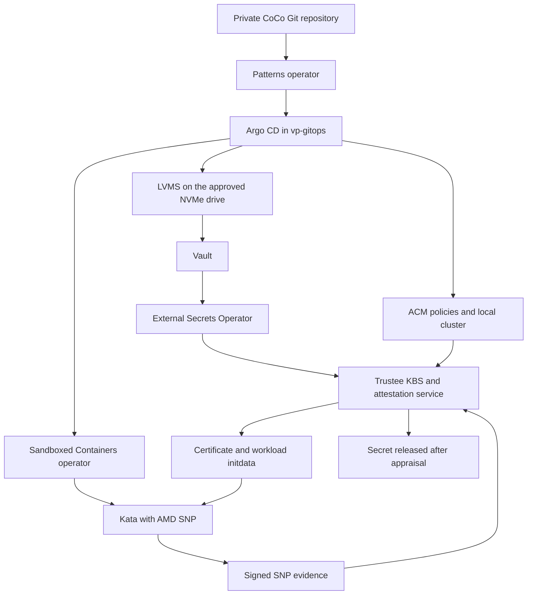

# Rebuilding the edge RTX6K confidential container baseline

> **DRAFT ENGINEERING RUNBOOK / LAB RECORD — NOT PRODUCTION READY.**
> Historical CPU-only snapshot at `5f158c3`, recorded 7 October 2026. The staged installation was tested; the complete clean-cluster rebuild procedure has not been rerun. These guides have not completed a handoff review. Read the [documentation status and sequence](../README.md) first. The later [model-key policy phase](../../model-key-policy.md) supersedes statements here that GPU-required key release remains future work. Do not roll back the policy on an existing cluster while protected model keys remain mounted.

This runbook recreates the **CPU confidential-container deployment validated on 7 October 2026**, starting with a healthy, clean OpenShift 4.22.15 single-node cluster on the same Dell server. It installs the Validated Patterns CoCo stack, AMD SEV-SNP Kata runtime, Trustee, Vault, LVMS, and the demonstration workloads. Follow the steps in order and check each checkpoint before continuing.

The successful end state is real secret delivery from Trustee into an AMD SNP confidential VM, with `oc exec` permitted in the debug example and denied by the guest policy in the secure example. OpenShift installation, NVIDIA confidential GPU enablement, inference serving, and production hardening are separate work. The upstream `kbs-access-sealed` example is a placeholder Kubernetes Secret, not a completed cryptographically sealed-secret demonstration.

The commands reconstruct the installation and incorporate the corrections discovered during it. The complete procedure has **not been rerun destructively from scratch** to test this document. The original installation, corrected measurement calculation, real KBS retrieval, and secure exec denial were verified on the server. Documentation helper scripts have been syntax checked; the validation helper was exercised against the existing deployment. See [VALIDATION-RECORD.md](VALIDATION-RECORD.md) for the final results and test limits.

## Contents

1. [Scope and recorded hardware](#scope-and-recorded-hardware)
2. [What must exist before starting](#what-must-exist-before-starting)
3. [Recorded software versions](#recorded-software-versions)
4. [Prepare the workstation and access](#prepare-the-workstation-and-access)
5. [Check the clean cluster and storage](#check-the-clean-cluster-and-storage)
6. [Obtain the exact deployment source](#obtain-the-exact-deployment-source)
7. [Prepare private repository access](#prepare-private-repository-access)
8. [Prepare the installer container](#prepare-the-installer-container)
9. [Prepare SNP certificates and reference values](#prepare-snp-certificates-and-reference-values)
10. [Generate and configure secrets](#generate-and-configure-secrets)
11. [Render and inspect before installation](#render-and-inspect-before-installation)
12. [Install the pattern and approve the selected operators](#install-the-pattern-and-approve-the-selected-operators)
13. [Finish initialization after the reboot](#finish-initialization-after-the-reboot)
14. [Verify the installed runtime and attestation](#verify-the-installed-runtime-and-attestation)
15. [Troubleshooting and recovery](#troubleshooting-and-recovery)
16. [Retain the material needed for another rebuild](#retain-the-material-needed-for-another-rebuild)
17. [Version locking and changed hardware](#version-locking-and-changed-hardware)
18. [Sources and package inventory](#sources-and-package-inventory)

## Scope and recorded hardware

| Item | Validated installation |
| --- | --- |
| Logical server name | `edge-rtx6k` |
| OpenShift cluster name | `dell-rtx6kbse-3` |
| API | `https://api.dell-rtx6kbse-3.bmas-001.lab.rdu2.dc.redhat.com:6443` |
| API and ingress IP | `10.14.202.14` |
| Applications domain | `apps.dell-rtx6kbse-3.bmas-001.lab.rdu2.dc.redhat.com` |
| Node at installation | `9c-63-c0-dd-06-52` |
| Topology | One node with control-plane, master, and worker roles |
| CPUs | Two AMD EPYC 9555 processors, 64 cores each, 256 logical CPUs total |
| RAM | Approximately 752 GiB visible to the node |
| Confidential CPU technology | AMD SEV-SNP; SEV, SEV-ES, and SNP enabled; `/dev/sev` present |
| GPUs present | Four NVIDIA RTX PRO 6000 Blackwell Server Edition cards, PCI ID `10de:2bb5` |
| GPU PCI locations | `0000:42:00.0`, `0000:8c:00.0`, `0001:04:00.0`, `0001:c8:00.0` |
| Hardware profile deployed | `amd-snp`, CPU baseline |
| RuntimeClass | `kata-cc`, handler `kata-snp` |

The GPUs were inventoried but were not assigned to confidential workloads. The presence of `kata-cc-nvidia-gpu` in the runtime-class list does not prove that GPU passthrough, GPU confidential mode, GPU attestation, or inference works.

### Disk assignment

| Device at installation | Serial | Purpose |
| --- | --- | --- |
| `/dev/nvme0n1` | `8E80A0D804M3` | Approved 7.68 TB LVMS data drive |
| `/dev/nvme1n1` | `8E80A0CT04M3` | Excluded data drive |
| `/dev/nvme2n1` | `CN0CMFVPFCP0054700ZL` | Dell BOSS OS disk, about 894 GiB; excluded |
| `/dev/nvme3n1` | `8E80A0D904M3` | Excluded data drive |
| `/dev/nvme4n1` | `8E80A0E104M3` | Excluded data drive |

The configuration selects the approved disk by stable ID:

```text
/dev/disk/by-id/nvme-eui.01000000000000058ce38ee3034e25da
```

Linux NVMe numbering can change after installation or firmware work. Confirm the stable ID resolves to the expected **serial number**, not merely to `nvme0n1`. LVMS creates volume group `vg1`, thin pool `thin-pool-1`, and StorageClass `lvms-vg1`. The validated Vault claim was 10 GiB.

### Architecture



Vault, Trustee, and the attested workloads share this lab cluster. That reproduces the tested topology; it does not provide an independent external trust service. Image policy is `insecureAcceptAnything` in this baseline even though hardware attestation and guest exec restrictions are enforced. Those are different controls.

## What must exist before starting

- A healthy, licensed/entitled OpenShift **4.22.15** single-node cluster. Its initial installation and BIOS setup are outside this runbook.
- An administrator kubeconfig for that new cluster. A kubeconfig from the previous cluster generally cannot authenticate to a reinstall.
- Network access from the workstation/container to the API, GitHub and required registries; access from the cluster to its route domain and registries; working time synchronization.
- Red Hat registry credentials with access to the required operator and operand images. The cluster pull secret was used in the validated deployment.
- Read access to the private deployment repository. Write/admin access is required only if making a new fork/branch or adding a deploy key.
- The approved data drive either blank or deliberately prepared for reuse. Reinstalling OpenShift on the OS disk does **not** necessarily clear old LVMS volumes from the data drive.
- A workstation with Bash, Git, `oc`, `kubectl`, Helm, Podman, Python 3, `curl`, `jq`, OpenSSL, and optionally the GitHub CLI `gh`. Python helpers that edit YAML additionally need PyYAML.
- Adequate workstation and Podman VM disk space. Reserve roughly **60 GiB of free working space** as an operational allowance, not a measured minimum. Check both filesystems. The first installation exhausted the Mac disk and damaged the local Podman runtime state; the cluster was unaffected and validation was completed directly.

Use a Bash terminal for the following commands. Do not enable `set -x` while handling credentials. None of the supplied files contains a kubeconfig, private deploy key, registry pull secret, Vault token, unseal key, or generated test-secret value.

## Recorded software versions

The full machine-readable snapshot is [deployment-versions.json](deployment-versions.json). These versions were actually installed, not inferred from current catalog defaults.

| Component | Version or revision |
| --- | --- |
| OpenShift | `4.22.15` |
| Kubernetes | `v1.35.6` |
| RHCOS host kernel | `5.14.0-687.48.1.el9_8.x86_64` |
| Deployment Git commit | `5f158c30f120f9eb041d5d77a81fedb916684bb3` |
| Upstream base commit | `aa04a093268be8ac92174313848a4c44298fbc41` |
| Patterns operator | `0.0.81` |
| OpenShift GitOps | `1.22.1` |
| OpenShift Sandboxed Containers | **`1.13.0`** |
| Trustee operator | **`1.2.0`** |
| External Secrets operator | `1.2.1` |
| LVMS operator | `4.22.0` |
| ACM and multicluster engine | `2.17.3` |
| OpenShift Virtualization operator | `4.22.12` |
| cert-manager operator | `1.20.1` |
| NFD CSV | `nfd.4.22.0-202609291750` |
| Vault image version | `1.21.4-ubi` |
| Kata host RPM | `kata-containers-3.31.0-5.rhaos4.22.el9.x86_64` |
| OVMF RPM | `edk2-ovmf-20241117-8.el9.noarch` |
| Kata guest kernel | `6.12.0-211.16.1.el10_2.x86_64` |
| Reference-value tooling | `osc-veritas[snp]==0.1.3rc1`, `sev-snp-measure==0.0.13` |
| Hardware certificate tooling | `snphost v0.7.0`, Linux x86-64 binary |

| Helm chart | Resolved version |
| --- | --- |
| `pattern-install` | `0.0.18` |
| `clustergroup` | `0.9.58` |
| `trustee` | `0.10.2` |
| `acm` | `0.1.27` |
| `hashicorp-vault` | `0.1.8` |
| `openshift-external-secrets` | `0.0.4` |
| `sandboxed-containers` | `0.2.1` |
| `sandboxed-policies` | `0.2.0` |
| Kyverno and local application charts | Vendored in the deployment Git commit |

**Reproducibility boundary:** the recorded Git branch pins the critical OSC/Trustee starting versions, Trustee chart, and clustergroup chart, but some other chart constraints, operator channels, and image tags float. A Git commit alone is not a complete offline or byte-for-byte software lock. Section [Version locking and changed hardware](#version-locking-and-changed-hardware) explains how to retain and pin the rest. Do not silently substitute newer software if a recorded version has disappeared from a catalog.

## Prepare the workstation and access

### Establish paths

Unpack the rebuild package into a local directory. Set `KIT` to its absolute path, and choose a separate working directory:

```bash
export KIT=/absolute/path/to/coco-pattern/docs/edge-rtx6k/cpu-baseline
export REBUILD_WORK="$PWD/edge-rtx6k-work"
export SECURE="$REBUILD_WORK/secure"
export REPO="$REBUILD_WORK/coco-pattern"
mkdir -p "$SECURE"
chmod 700 "$SECURE"
umask 077

export CLUSTER_IP=10.14.202.14
export API_HOST=api.dell-rtx6kbse-3.bmas-001.lab.rdu2.dc.redhat.com
export APPS_DOMAIN=apps.dell-rtx6kbse-3.bmas-001.lab.rdu2.dc.redhat.com
export REPO_URL=git@github.com:pmatouse/coco-pattern-edge-rtx6k.git
export DEPLOY_BRANCH=codex/edge-rtx6k
export BASE_COMMIT=5f158c30f120f9eb041d5d77a81fedb916684bb3
```

These shell variables must be set again in each terminal you use. The remaining commands assume `KUBECONFIG` is also exported in that terminal.

### Install the new cluster kubeconfig

Copy the administrator kubeconfig obtained from the new OpenShift installation:

```bash
cp /path/to/new-cluster-kubeconfig "$SECURE/cluster.kubeconfig"
chmod 600 "$SECURE/cluster.kubeconfig"
export KUBECONFIG="$SECURE/cluster.kubeconfig"
```

If workstation DNS cannot resolve the API name, preserve certificate verification while using the IP:

```bash
CLUSTER_ENTRY=$(oc config view --minify -o jsonpath='{.contexts[0].context.cluster}')
oc config set-cluster "$CLUSTER_ENTRY" \
  --server="https://${CLUSTER_IP}:6443" \
  --tls-server-name="$API_HOST"
oc whoami
oc auth can-i '*' '*' --all-namespaces
oc get clusterversion
```

Expected: administrator privileges and `4.22.15`, Available `True`, Progressing `False`. Do not solve name resolution by disabling TLS verification.

The API override does not fix route DNS. Normal DNS should resolve `*.${APPS_DOMAIN}` to the ingress IP. `/etc/hosts` cannot implement a wildcard. If host entries are necessary, include individual names such as the console, OAuth, `vault-vault`, `kbs`, `secure-hello-openshift`, and `kbs-access-curl-kbs-access` under the applications domain. The validation script can override route DNS with `--ingress-ip` and does not require hosts-file edits.

### Save the registry pull secret

```bash
oc get secret pull-secret -n openshift-config \
  -o jsonpath='{.data.\.dockerconfigjson}' \
  | python3 -c 'import base64,sys;sys.stdout.buffer.write(base64.b64decode(sys.stdin.buffer.read()))' \
  > "$SECURE/pull-secret.json"
chmod 600 "$SECURE/pull-secret.json"
```

This copies credentials into a protected local file. It does not print them. Do not add that file to the deployment repository or this documentation package.

## Check the clean cluster and storage

### Cluster health

```bash
oc get nodes
oc get co
oc get mcp
oc get storageclass,pv
oc get pvc -A
oc get subscriptions.operators.coreos.com -A
oc get runtimeclass
```

The starting point used for the first install had no application operators, no StorageClasses or PVCs, and no Kata RuntimeClasses. Existing resources require deliberate reconciliation; do not treat this as an uninstall or cleanup script.

Select the only node and its existing Machine Config Daemon pod. These names are discovered anew because they can change after reinstallation:

```bash
test "$(oc get nodes -o json | jq '.items | length')" -eq 1
export NODE=$(oc get nodes -o jsonpath='{.items[0].metadata.name}')
export MCD=$(oc get pods -n openshift-machine-config-operator \
  -l k8s-app=machine-config-daemon --field-selector "spec.nodeName=$NODE" \
  -o jsonpath='{.items[0].metadata.name}')

oc exec -n openshift-machine-config-operator "$MCD" -c machine-config-daemon -- \
  chroot /rootfs sh -c 'lscpu; ls -l /dev/sev; cat /sys/module/kvm_amd/parameters/sev /sys/module/kvm_amd/parameters/sev_es /sys/module/kvm_amd/parameters/sev_snp'
```

Expected: AMD EPYC CPUs, `/dev/sev`, and `Y` for the three enabled parameters. If SNP is unavailable, resolve firmware/BIOS and host prerequisites before continuing. Do not apply Intel TDX configuration to this machine.

### Verify the exact LVMS target

```bash
oc exec -n openshift-machine-config-operator "$MCD" -c machine-config-daemon -- \
  chroot /rootfs sh -c '
    lsblk -o NAME,SIZE,MODEL,SERIAL,FSTYPE,MOUNTPOINTS
    readlink -f /dev/disk/by-id/nvme-eui.01000000000000058ce38ee3034e25da
    wipefs --no-act /dev/disk/by-id/nvme-eui.01000000000000058ce38ee3034e25da
    pvs --noheadings -o pv_name,vg_name,pv_size
  '
```

`wipefs --no-act` is inspection only. The selected device must have serial `8E80A0D804M3`. In the original clean state it had no filesystem or partition signatures.

**LVMS will write to this drive when the storage application reconciles.** If it contains old `vg1` metadata or useful data, stop here. A fresh OpenShift OS installation does not erase the LVMS/Vault data drive. Decide whether to preserve or deliberately destroy the old data, back up what is needed, and have the disk prepared while it is not mounted or used by any workload. This runbook intentionally does not automatically wipe or remove volume groups.

Checkpoint: cluster healthy, SNP enabled, exact disk identity confirmed, and the target disk ready for a new LVMS installation.

## Obtain the exact deployment source

```bash
gh auth status
gh repo clone pmatouse/coco-pattern-edge-rtx6k "$REPO" -- --branch "$DEPLOY_BRANCH"
git -C "$REPO" rev-parse HEAD
test "$(git -C "$REPO" rev-parse HEAD)" = "$BASE_COMMIT"
git -C "$REPO" remote set-url origin "$REPO_URL"
git -C "$REPO" branch --set-upstream-to="origin/$DEPLOY_BRANCH" "$DEPLOY_BRANCH"
```

If the comparison fails because the branch moved, stop and compare it with the recorded commit. Do not reset or force-push a shared branch. Create a new branch from the recorded commit in a repository you control, update `main.git.revision`, commit the changes, and push that branch. Argo CD reads the remote repository, not uncommitted workstation edits.

[coco-pattern-5f158c3.tar.gz](coco-pattern-5f158c3.tar.gz) contains the tracked source at the recorded commit without credentials. It is a source recovery copy, not a `.git` repository or a replacement for the reachable Git remote used by Argo CD.

### Configuration already present in that commit

| File | Required setting or correction |
| --- | --- |
| `values-global.yaml` | `main.clusterGroupName: baremetal`; `global.hardware.profile: amd-snp`; `global.singleArgoCD: true`; `storageProvider: lvm`; `clusterVersion: "4.22"`; runtime `kata-cc`; `secured: true`; `bypassAttestation: false`; `autoApproveManualInstallPlans: false` |
| `values-baremetal.yaml` | Connected deployment; no `values-baremetal-airgap.yaml` in shared values; Trustee chart `0.10.2`; OSC `1.13.0` and Trustee `1.2.0` subscriptions use Manual approval |
| `overrides/values-hw-amd-snp.yaml` | Intel and GPU applications disabled; TDX MachineConfig disabled; both `kbs.snp.enabled` and `kbs.baremetal.enabled` enabled |
| `overrides/values-storage-lvm.yaml` | Only the approved stable disk path; Vault StorageClass `lvms-vg1` |
| `charts/hub/storage/templates/lvmcluster.yaml` | Supports the explicit `deviceSelector` rather than discovering every free drive |
| `overrides/values-trustee.yaml` | `kbs.workerCount: 4` |
| `overrides/values-snp-vcek.yaml` | Hardware ID `631fe8a14126299e`, Secret `snp-vcek-631fe8a14126299e` |

Helm replaces arrays when values are merged. The AMD profile must retain **both** Trustee override entries; otherwise it enables SNP but loses the bare-metal firmware-reference ExternalSecret. The VCEK values file has an outdated placeholder comment, but its actual list is populated.

## Prepare private repository access

Generate a read-only deploy key for this rebuild, or use an existing securely retained key authorized for the repository. The cluster only needs read access.

```bash
ssh-keygen -t ed25519 -N '' -C coco-edge-rtx6k-readonly \
  -f "$SECURE/gitops-deploy-key"
gh repo deploy-key add "$SECURE/gitops-deploy-key.pub" \
  --repo pmatouse/coco-pattern-edge-rtx6k --title coco-edge-rtx6k-rebuild

mkdir -p "$SECURE/ssh"
gh api meta --jq '.ssh_keys[] | "github.com " + .' > "$SECURE/ssh/known_hosts"
```

The `gh` command requires repository administration rights and adds only the public key. Do not pass `--allow-write`. Obtain GitHub host keys from the authenticated HTTPS API as above rather than blindly trusting an SSH key scan.

Create the repository credentials used by the bootstrap, Argo CD, and ACM:

```bash
python3 "$KIT/scripts/bootstrap-repo-secrets.py" \
  --repo "$REPO_URL" --private-key "$SECURE/gitops-deploy-key"
```

The helper creates only these namespaces/secrets and prints resource names, not key contents:

| Namespace | Secret | Consumer |
| --- | --- | --- |
| `patterns-operator` | `coco-deploy-git` | Pattern repository access |
| `vp-gitops` | `vp-private-repo-credentials` | Main Argo CD instance |
| `openshift-gitops` | `vp-private-repo-credentials` | Source expected by ACM chart 0.1.27 private-repository policy |

The third copy is essential. Without it, ACM's `private-hub-config` policy looks in `openshift-gitops` and fails even though Argo CD in `vp-gitops` can read the repository. It is the same read-only key, not a second GitOps installation.

## Prepare the installer container

The successful workaround for Mac bind-mount I/O errors was a persistent container with data stored inside Podman volumes. A Linux administration host is also suitable. Avoid cloud-synchronized paths for large working data.

```bash
export UTILITY_IMAGE=quay.io/validatedpatterns/utility-container:latest
podman pull "$UTILITY_IMAGE"
podman image inspect "$UTILITY_IMAGE" --format '{{json .RepoDigests}}' \
  > "$SECURE/utility-image-digests.json"

podman volume create coco-rebuild-home
podman volume create coco-rebuild-source
podman run -d --name coco-rebuild \
  -v coco-rebuild-home:/pattern-home \
  -v coco-rebuild-source:/opt/coco-pattern \
  -e KUBECONFIG=/pattern-home/cluster.kubeconfig \
  -e PULL_SECRET=/pattern-home/pull-secret.json \
  -e VALUES_SECRET=/pattern-home/values-secret-coco-pattern.yaml \
  --entrypoint /bin/bash "$UTILITY_IMAGE" -c 'sleep infinity'

podman exec coco-rebuild sh -c 'test "$HOME" = /pattern-home'
podman exec coco-rebuild mkdir -p /pattern-home/.ssh /pattern-home/.coco-pattern
podman cp "$REPO/." coco-rebuild:/opt/coco-pattern/
podman cp "$SECURE/cluster.kubeconfig" coco-rebuild:/pattern-home/cluster.kubeconfig
podman cp "$SECURE/pull-secret.json" coco-rebuild:/pattern-home/pull-secret.json
podman cp "$SECURE/gitops-deploy-key" coco-rebuild:/pattern-home/gitops-deploy-key
podman cp "$SECURE/ssh/known_hosts" coco-rebuild:/pattern-home/.ssh/known_hosts
```

The `HOME` check must pass; it verifies the image's expected environment without changing the workstation home directory. If you already have a container or volumes with these names, inspect them and choose new names for a fresh rebuild. Do not overwrite an old credential volume unintentionally.

Configure SSH within the container:

```bash
podman exec -i coco-rebuild sh -c 'umask 077; cat > /pattern-home/.ssh/config' <<'EOF'
Host github.com
  HostName github.com
  User git
  IdentityFile /pattern-home/gitops-deploy-key
  IdentitiesOnly yes
  StrictHostKeyChecking yes
  UserKnownHostsFile /pattern-home/.ssh/known_hosts
EOF

podman exec coco-rebuild chmod 600 /pattern-home/cluster.kubeconfig \
  /pattern-home/pull-secret.json /pattern-home/gitops-deploy-key
podman exec -w /opt/coco-pattern coco-rebuild git config core.sshCommand \
  'ssh -F /pattern-home/.ssh/config -o UserKnownHostsFile=/pattern-home/.ssh/known_hosts'
podman exec -w /opt/coco-pattern coco-rebuild git ls-remote origin "refs/heads/$DEPLOY_BRANCH"
podman exec coco-rebuild oc whoami
podman exec coco-rebuild microdnf install -y cpio file
podman exec -w /opt/coco-pattern coco-rebuild python3 -m pip install \
  -r requirements.txt cryptography 'sev-snp-measure==0.0.13'
```

The utility image tag is mutable and the original local image digest was not retained before the Podman failure. Record the pulled digest, inspect the tools, and retain it for future rebuilds. This is an explicit reproducibility gap; the observed in-cluster image digests in the version snapshot do not replace the local utility image.

## Prepare SNP certificates and reference values

### Obtain a fresh certificate URL from this hardware

Download the official Linux x86-64 binary to the workstation, then copy it into the existing maintenance container. Do not attempt to execute this Linux binary on macOS:

```bash
curl -fL https://github.com/virtee/snphost/releases/download/v0.7.0/snphost \
  -o "$REBUILD_WORK/snphost"
oc exec -i -n openshift-machine-config-operator "$MCD" -c machine-config-daemon -- \
  sh -c 'umask 077; cat > /tmp/coco-snphost; chmod 700 /tmp/coco-snphost' \
  < "$REBUILD_WORK/snphost"
oc exec -n openshift-machine-config-operator "$MCD" -c machine-config-daemon -- \
  /tmp/coco-snphost show vcek-url > "$SECURE/vcek-url.txt"
cat "$SECURE/vcek-url.txt"
```

The output is a public certificate retrieval URL, not a login credential. On the validated machine it was:

```text
https://kdsintf.amd.com/vcek/v1/Turin/631FE8A14126299E?fmcSPL=01&blSPL=03&teeSPL=02&snpSPL=06&ucodeSPL=117
```

Parse the hardware ID from the URL path and download the certificate:

```bash
export HWID=$(python3 - "$SECURE/vcek-url.txt" <<'PY'
from pathlib import Path
from urllib.parse import urlsplit
import re,sys
u=urlsplit(Path(sys.argv[1]).read_text().strip())
assert u.scheme=='https' and u.netloc=='kdsintf.amd.com'
h=u.path.rstrip('/').split('/')[-1].lower()
assert re.fullmatch('[0-9a-f]+',h)
print(h)
PY
)
mkdir -p "$SECURE/snp-vcek/$HWID"
curl --fail --show-error --location "$(cat "$SECURE/vcek-url.txt")" \
  -o "$SECURE/snp-vcek/$HWID/vcek.der"
openssl x509 -inform DER -in "$SECURE/snp-vcek/$HWID/vcek.der" \
  -noout -issuer -subject -dates
```

For the same baseline, `HWID` must be `631fe8a14126299e` and the TCB query parameters must match those above. The issuer was `SEV-Turin`. The supplied [reference/vcek.der](reference/vcek.der) is a public copy of that certificate for reference, not permission to reuse it after firmware or hardware changes.

The upstream collector at the recorded commit searches for a 64-character hexadecimal ID. **Turin returned a 16-character ID**, so that collector did not work unchanged. Use the URL-path parsing above. The offline cache path uses the lowercase ID. The recorded two-socket host successfully attested using this collected certificate; on changed or additional hardware, collect and validate the certificates actually needed by each node rather than assuming this ID applies.

If the ID changes, update and push `overrides/values-snp-vcek.yaml` in your deployment branch. Its `hwid`, `secretName`, and the Vault entry name supplied below must agree. A local-only YAML change does not reach Argo CD.

Copy the certificate into the installer:

```bash
podman exec coco-rebuild mkdir -p "/pattern-home/.coco-pattern/snp-vcek/$HWID"
podman cp "$SECURE/snp-vcek/$HWID/vcek.der" \
  "coco-rebuild:/pattern-home/.coco-pattern/snp-vcek/$HWID/vcek.der"
```

### Recompute the corrected launch measurements

The original generic collection produced 96 measurements, but none matched the CPU guest. The installed Kata command line includes:

```text
agent.log=debug agent.launch_process_timeout=6 cgroup_no_v1=all
```

Veritas 0.1.3rc1's default command line omitted `agent.launch_process_timeout=6`. SNP measures the command line, so this difference correctly caused Trustee to deny secret release. The supplied collector adds the actual argument and computes **32 CPU measurements for 1 through 32 vCPUs**. It excludes GPU variants.

```bash
podman cp "$KIT/scripts/collect-edge-snp-reference-values.py" \
  coco-rebuild:/pattern-home/collect-edge-snp-reference-values.py
podman exec coco-rebuild python3 /pattern-home/collect-edge-snp-reference-values.py
```

This verifies the OpenShift release payload, extracts its Kata/OVMF artifacts, checks their SHA-256 hashes against the recorded installed artifacts, and calculates the measurements independently of any guest-provided expected value. It then adds these exact TCB reference arrays:

```json
{
  "snp_bootloader": [3],
  "snp_tee_svn": [2],
  "snp_snp_svn": [6],
  "snp_microcode": [117]
}
```

These are numeric arrays, not strings. They were derived from the hardware's VCEK request and subsequently matched attested evidence. The certificate request also contains `fmcSPL=01`; Trustee's verifier checks the certificate/report relationship. This chart's hardware appraisal explicitly references the four keys above.

Expected collector output: `Saved 32 CPU launch measurements and exact TCB reference values.` Keep the output file outside Git:

```bash
podman cp coco-rebuild:/pattern-home/.coco-pattern/firmware-reference-values.json \
  "$SECURE/firmware-reference-values.json"
```

[reference/firmware-reference-values.json](reference/firmware-reference-values.json) contains the verified final baseline. It can seed an identical rebuild, but its validity is conditional on the same artifacts, CPU model, command line and TCB. Do not reuse it unconditionally on a different release or firmware. Do not fix an unknown measurement by copying it from a failing attestation log into the allowlist.

### Recorded artifact identity

| Artifact | SHA-256 |
| --- | --- |
| OCP release payload | `fed788eac1c99388dd9b78dda4d6a73e39b70abb00ca918d2bb456a97187f0c1` |
| RHCOS extensions image | `48cf2f0f325cad11dba35456f34883121b14eb2d60f0aa66897dd63392b9057f` |
| `OVMF.amdsev.fd` | `1aa196fe94e56809aa668fc4eabfc50923131288e018bcf0c6ab4dd3581bd850` |
| Guest `vmlinuz` | `0317da8a23853124ed4e4da6c56254f40a741ff4507e1afbbcb7f32e5c097206` |
| CPU `kata-cc.initrd` | `1f9b3a90c60ec7a94985ae966fc66ecb4d04055ca3471b9f0074068f4dac8b62` |

The verified one-vCPU guest measurement was:

```text
82e28e800818c02c5c7acdfbaf091d848cb16e75388db83b0e483acab10ba28c3aeb1d32a5a8db3d4f6fbee4d3644d89
```

## Generate and configure secrets

### Create the signing key when jose is unavailable

`make gen-secrets` uses `jose` only when the JWK does not already exist. The utility environment used during installation did not provide that package. This equivalent P-256 generator creates the key once and never replaces an existing one:

```bash
podman exec -i coco-rebuild python3 - <<'PY'
import base64,json,os
from pathlib import Path
from cryptography.hazmat.primitives.asymmetric import ec
os.umask(0o077)
p=Path('/pattern-home/.coco-pattern');p.mkdir(parents=True,exist_ok=True)
private=p/'sealed-secrets-signing.jwk';public=p/'sealed-secrets-signing-pub.jwk'
if private.exists():
    assert public.exists(), 'Private key exists but public key is missing; recover it instead of regenerating'
else:
    k=ec.generate_private_key(ec.SECP256R1()).private_numbers()
    def enc(n):return base64.urlsafe_b64encode(n.to_bytes(32,'big')).decode().rstrip('=')
    pub={'kty':'EC','crv':'P-256','alg':'ES256','kid':'coco-signing-key','use':'sig',
         'x':enc(k.public_numbers.x),'y':enc(k.public_numbers.y)}
    private.write_text(json.dumps(dict(pub,d=enc(k.private_value)))+'\n')
    public.write_text(json.dumps(pub)+'\n')
    private.chmod(0o600);public.chmod(0o600)
print('Signing-key files ready; key material not printed.')
PY

podman exec -w /opt/coco-pattern coco-rebuild sh -ec 'umask 077; make gen-secrets; make cache-keys'
```

The generator supplies an empty `{}` placeholder for Azure PCR values. Keep that placeholder for this bare-metal deployment. Ensure it did not replace the real `firmware-reference-values.json`. SSH access into confidential guests remains disabled.

### Add the binary VCEK field

Add the certificate entry to the generated values-secret file idempotently:

```bash
podman exec -i -e EDGE_HWID="$HWID" coco-rebuild python3 - <<'PY'
import os,yaml
from pathlib import Path
h=os.environ['EDGE_HWID']
p=Path('/pattern-home/values-secret-coco-pattern.yaml')
d=yaml.safe_load(p.read_text());name='snpVcek-'+h
entry={'name':name,'vaultPrefixes':['hub'],'fields':[{
    'name':'vcek.der','path':f'/pattern-home/.coco-pattern/snp-vcek/{h}/vcek.der','base64':True}]}
d['secrets']=[x for x in d['secrets'] if x['name']!=name]+[entry]
p.write_text(yaml.safe_dump(d,sort_keys=False));p.chmod(0o600)
print('Configured VCEK entry:',name)
PY
```

The `base64: true` flag is required because DER is binary and Vault KV stores JSON. Trustee's VCEK ExternalSecret decodes it. The firmware `json` field is plain JSON text and should not receive this binary encoding flag.

Review the generated file in a secure editor, not in a shared terminal log. The expected nine entry names are `kbsres1`, `passphrase`, `attestationStatus`, `securityPolicyConfig`, `sealedSecretsSigningKey`, `sigstore-keys`, `pcrStash`, `firmwareReferenceValues`, and `snpVcek-631fe8a14126299e`. Preserve the actual template entries rather than reducing the file to only the VCEK stanza. Generated example-secret values can differ between clean builds; reproducing their old byte values requires a separate secret backup.

## Render and inspect before installation

```bash
podman exec -w /opt/coco-pattern \
  -e TOKEN_SECRET=coco-deploy-git -e TOKEN_NAMESPACE=patterns-operator \
  -e TARGET_BRANCH="$DEPLOY_BRANCH" -e TARGET_ORIGIN=origin \
  coco-rebuild make show

podman exec -w /opt/coco-pattern \
  -e EXTRA_HELM_OPTS='-f values-global.yaml' \
  coco-rebuild make validate-schema
```

`preview-all` is mentioned in the repository guidance but is absent from this revision's Makefile. Use an explicit Helm render instead. The additional global values fix the standalone schema-validation context used by this revision.

From the workstation, render the clustergroup with the same important value layers:

```bash
helm template coco-pattern-baremetal "$KIT/charts/clustergroup-0.9.58.tgz" \
  --namespace patterns-operator \
  -f "$REPO/values-global.yaml" -f "$REPO/values-baremetal.yaml" \
  -f "$REPO/overrides/values-storage-lvm.yaml" \
  -f "$REPO/overrides/values-4.22.yaml" \
  -f "$REPO/overrides/values-hw-amd-snp.yaml" \
  --set-string global.repoURL="$REPO_URL" \
  --set-string global.targetRevision="$DEPLOY_BRANCH" \
  --set-string global.clusterPlatform=None \
  --set-string global.clusterVersion=4.22 \
  --set-string global.vpArgoNamespace=vp-gitops \
  --set-string global.multiSourceRepoUrl=quay.io/validatedpatterns \
  > "$REBUILD_WORK/rendered-clustergroup.yaml"

helm template storage "$REPO/charts/hub/storage" \
  -f "$REPO/values-global.yaml" -f "$REPO/values-baremetal.yaml" \
  -f "$REPO/overrides/values-storage-lvm.yaml" \
  > "$REBUILD_WORK/rendered-storage.yaml"
```

Inspect the storage render for the single approved `deviceSelector.paths` entry. Inspect the clustergroup render for `redhat-operators`, the two Manual approval subscriptions and their exact `startingCSV` values, AMD profile, Trustee chart `0.10.2`, and absence of active Intel/GPU subscriptions. The root render contains child Application objects; the separate storage render is what proves the actual LVMCluster disk selector.

Checkpoint: Git remote readable, administrator access works from the container, secrets exist locally, certificate identity matches the host, corrected references generated, schema validation passes, and the rendered disk selector is exact.

## Install the pattern and approve the selected operators

### Start installation

Run in terminal A and leave it open:

```bash
podman exec \
  -e TOKEN_SECRET=coco-deploy-git \
  -e TOKEN_NAMESPACE=patterns-operator \
  -e TARGET_BRANCH="$DEPLOY_BRANCH" \
  -e TARGET_ORIGIN=origin \
  -w /opt/coco-pattern coco-rebuild make install
```

The installer bootstraps Patterns/GitOps, waits for Vault, loads secrets, and checks Argo application health. A message saying installation succeeded early in the output means bootstrap manifests were accepted; it is **not** the final attestation test.

### Observe from terminal B

```bash
oc get subscriptions.operators.coreos.com -A
oc get installplans.operators.coreos.com -A
oc get applications.argoproj.io -n vp-gitops
oc get pods,pvc -n vault
oc get lvmcluster -n openshift-storage
```

Use fully qualified `applications.argoproj.io` and `subscriptions.operators.coreos.com`. After ACM is installed, unqualified names or short names can resolve to a different API group.

### Approve only the selected initial plans

When OSC and Trustee plans appear:

```bash
python3 "$KIT/scripts/approve-coco-plans.py"
python3 "$KIT/scripts/approve-coco-plans.py" --apply
```

The helper approves only an initial plan whose CSV list is exactly one of these in its matching namespace:

```text
openshift-sandboxed-containers-operator  sandboxed-containers-operator.v1.13.0
trustee-operator-system                 trustee-operator.v1.2.0
```

It does not approve a newer plan or a plan containing extra CSVs. Inspect any mismatch rather than broadening approval automatically. Later upgrade plans for `1.13.1` or `1.2.1` can remain unapproved; `startingCSV` alone does not pin future updates.

### Expected reconciliation order

1. Patterns operator and GitOps install; the `vp-gitops` Argo instance becomes available.
2. LVMS initializes the selected data disk. Vault obtains its 10 GiB claim on `lvms-vg1`.
3. Vault initializes and unseals. The installer loads the prepared secrets.
4. The `wait-for-vault-unsealed` hook waits an additional 120 seconds for secrets.
5. OSC, Trustee, NFD, cert-manager, and ACM dependencies install. Some child charts temporarily report missing CRDs.
6. Kata changes the node configuration. The SNO API becomes unavailable during the node reboot.
7. The node, storage, scheduler, Vault, and operator controllers recover. Vault's periodic job unseals it again.
8. ACM creates/imports `local-cluster`, starts its policy controllers, and distributes registry credentials and references.
9. Trustee certificates, KBS, initdata, and confidential demonstration workloads become ready.

The observed Kata reboot interrupted API access for several minutes. There was also a delay while the scheduler acquired its leader lease. Temporary `Connection refused`, `ContainerCreating`, missing CRDs, and sealed Vault immediately after reboot are not by themselves reasons to reinstall everything.

## Finish initialization after the reboot

### Check recovery

```bash
oc get --raw=/readyz
oc get nodes,mcp,kataconfig,runtimeclass
oc get co
oc get pods -n vault
oc get clustersecretstore vault-backend
oc get managedclusters
oc get multiclusterhub -n open-cluster-management
```

Wait for node Ready; MachineConfigPool master Updated `True`, Updating/Degraded `False`; Kata ready-node count 1; `kata-cc` handler `kata-snp`; Vault Ready; `local-cluster` Joined/Available `True`.

The unseal cronjob normally runs every five minutes. To request an immediate run after Vault's pod is running:

```bash
oc create job "coco-unseal-$(date +%s)" \
  --from=cronjob/unsealvault-cronjob -n imperative
```

### Confirm the corrected references reached Vault and Trustee

If normal secret loading completed with the corrected file, this update is unnecessary. To repair the firmware entry without rerunning the whole installer:

```bash
python3 "$KIT/scripts/load-reference-values.py" "$SECURE/firmware-reference-values.json"
```

The helper retrieves the already-initialized Vault administrative token from `imperative/vaultkeys` in memory, sends it through stdin to `vault-0`, and updates only `secret/hub/firmwareReferenceValues`. It does not print or save the token and does not reinitialize Vault. Use it only as cluster administrator on the intended cluster.

Check the public measurement data that ACM published:

```bash
oc get cm rvps-reference-values -n trustee-operator-system -o json \
  | python3 -c 'import base64,json,sys; x=json.load(sys.stdin); r=json.loads(x["data"]["reference_value"]); v=json.loads(base64.urlsafe_b64decode(r["snp_launch_measurement"])); print("measurement count:",len(v["value"]))'
oc get externalsecrets -n trustee-operator-system
oc get policies.policy.open-cluster-management.io -A
```

Expected: 32 CPU measurements; Trustee external secrets Ready; local-cluster `pull-secret-credential-policy`, `rvps-policy`, and private-repository policy Compliant. The hub-to-spoke policy can have no compliance result when there are no selected spokes; do not invent spoke infrastructure just to populate that field.

### Generate workload initdata when dependencies are ready

```bash
oc get secret kbs-tls-self-signed -n imperative -o name
oc get pods -n trustee-operator-system
oc create job "coco-initdata-$(date +%s)" \
  --from=cronjob/imperative-cronjob -n imperative
oc get jobs,pods -n imperative
oc get cm initdata debug-initdata -n imperative
oc get cm initdata debug-initdata -n hello-openshift
oc get cm debug-initdata -n kbs-access
```

The certificate and Trustee must exist first. The first job can fail with `KBS TLS certificate not found` during bootstrap; rerun it after the certificate exists. The regular imperative cronjob repeats every ten minutes.

If `secure` or `insecure-policy` pods were created before initdata existed, recreate those demo deployments' pods once. Kyverno injects initdata at pod admission; creating the ConfigMap later cannot retroactively add it to an existing VM.

```bash
oc rollout restart deployment/secure deployment/insecure-policy -n hello-openshift
oc rollout status deployment/secure -n hello-openshift --timeout=15m
oc rollout status deployment/insecure-policy -n hello-openshift --timeout=15m
```

Do not restart all cluster workloads to fix a demo admission-order race.

## Verify the installed runtime and attestation

### Validate artifact identity on the installed node

Rediscover `MCD` after the reboot if its pod name changed. Check the installed RPMs and file hashes:

```bash
oc exec -n openshift-machine-config-operator "$MCD" -c machine-config-daemon -- \
  chroot /rootfs sh -c '
    rpm -q kata-containers edk2-ovmf
    sha256sum /usr/share/edk2/ovmf/OVMF.amdsev.fd \
      /usr/share/kata-containers/osbuilder-images/6.12.0-211.16.1.el10_2.x86_64/vmlinuz \
      /usr/share/kata-containers/osbuilder-images/6.12.0-211.16.1.el10_2.x86_64/kata-cc.initrd
    ps -eo args | grep "[q]emu-kvm" | head -4
  '
```

The hashes must match the earlier table. The validated CPU guest used `EPYC-v4`, SEV-SNP, `kernel-hashes=on`, `guest_features=0x1` in measurement calculation, and matching `nr_cpus`/`-smp` values. Verify the actual guest command line contains the timeout argument used by the collector. Stop and recompute from trusted artifacts if it differs.

### Run the acceptance checks

```bash
python3 "$KIT/scripts/validate-deployment.py" --ingress-ip "$CLUSTER_IP"
```

Expected output consists of five PASS checks:

- 14 Argo applications are Synced and Healthy.
- OpenShift operators are Available and not Degraded.
- Kata is ready on the single node and `kata-cc` uses `kata-snp`.
- `/bin/true` works through `oc exec` in the debug pod, while the secure pod rejects it with `ExecProcessRequest is blocked by policy`.
- The curl example's HTTP response exactly equals the configured KBS `key3` secret. The script compares bytes in memory and withholds the value.

The last test matters because the example init command uses `curl -s` without `--fail`; a completed init container alone does not prove that a secret was returned. The “sealed” sample is not used as proof of sealed-secret support.

If the parent application briefly reports OutOfSync for an otherwise unchanged child application, inspect the actual diff. A hard refresh cleared the observed comparison-cache discrepancy:

```bash
oc annotate applications.argoproj.io coco-pattern-baremetal -n vp-gitops \
  argocd.argoproj.io/refresh=hard --overwrite
```

Run the acceptance check again after reconciliation. Do not ignore a real spec change just to obtain a green status. A later documentation snapshot observed this parent-only discrepancy recur; all child applications remained Healthy. The final acceptance run for the installation had all 14 Synced and Healthy.

### Verify disk isolation

```bash
oc get lvmcluster lvmcluster -n openshift-storage -o yaml
oc get pvc -n vault
oc exec -n openshift-machine-config-operator "$MCD" -c machine-config-daemon -- \
  chroot /rootfs sh -c 'pvs --noheadings -o pv_name,vg_name,pv_size; lsblk -d -o NAME,SERIAL,FSTYPE'
```

Only the drive with serial `8E80A0D804M3` should be an LVM member in `vg1`. The original OS disk and other three data drives must remain excluded. The LVMCluster status reports its selected and excluded devices.

### Clean up the diagnostic binary

```bash
oc exec -n openshift-machine-config-operator "$MCD" -c machine-config-daemon -- \
  rm -f /tmp/coco-snphost /tmp/coco-sev-snp-measure.whl
```

These are temporary files created by this procedure inside the maintenance container, not host packages.

## Troubleshooting and recovery

| Symptom | Check and corrective action |
| --- | --- |
| API name does not resolve on the workstation | Use the IP plus the original TLS server name in the dedicated kubeconfig. Preserve the CA. Test route DNS separately. |
| `cannot find ... argoproj.io/v1beta1` immediately after bootstrap | Check GitOps Subscription/CSV and operator pods. The CRD was not ready yet during the observed bootstrap. |
| `fatal: no upstream configured` or origin validation fails | Set the deployment branch's upstream to `origin/<branch>` and verify `git ls-remote` from inside the installer. |
| ACM private-hub policy cannot find a secret in `openshift-gitops` | Run the repository-secret helper with the same read-only key; ensure all three credential locations exist. |
| Vault Pending with no StorageClass | Inspect LVMS operator, the LVMCluster device selector, and `lvms-vg1`. Do not broaden disk discovery. |
| Vault sealed after reboot | Wait for or trigger `unsealvault-cronjob`. Never initialize an already initialized Vault again. |
| ExternalSecret errors after Vault recovery | Check `clustersecretstore/vault-backend`. Once Ready, annotate the affected ExternalSecret with a new `force-sync` value to end an error backoff sooner. |
| Missing ACM Policy/Placement CRDs | Wait for ACM/MCE and policy controllers, then let Argo retry. Check `managedclusters` and the agent-addon namespace. |
| Jobs Pending with no node taints after reboot | Check scheduler logs and leader-lease acquisition. It recovered without manual node changes in the observed run. |
| `KBS TLS certificate not found` in init-data-gzipper | Wait for `imperative/kbs-tls-self-signed`, then create a fresh job from `imperative-cronjob`. |
| Kyverno rejects a pod because `debug-initdata` is missing | Finish the imperative job and initdata propagation before recreating the demo pod. |
| `CreateContainerError` or CDH `Get resource failed` | Check Trustee appraisal and KBS error logs. This can be an attestation denial rather than an image-download problem. |
| Hardware claim `2`, configuration claim `3`, executables claim `33` | Hardware/configuration passed, but launch measurement was not recognized. Check the exact kernel command line and verified artifacts; the missing timeout argument caused this here. |
| Hardware claim remains unrecognized | Confirm TCB numeric references and certificate/report versions, rather than setting `enforceHardware: false`. |
| VCEK cannot be found in OfflineStore | Check lowercase hardware ID, the DER Secret, mount path, and TCB/certificate identity. Turin's ID parser needs the correction described above. |
| Pod Running but real-secret comparison fails | Inspect the init result and CDH/KBS denial; do not count HTTP error text as a secret. |
| Mac Podman bind-mount `EIO` | Use persistent named volumes and copy inputs into the container. Keep source and credentials outside cloud file offloading. |
| Podman database malformed or SSH handshake EOF, host disk full | Stop treating the local wrapper as the source of cluster health. Restore workstation free space and repair Podman separately; retain credential backups. Do not reset Podman volumes containing the only keys. |

Useful read-only commands:

```bash
oc get applications.argoproj.io -n vp-gitops
oc get subscriptions.operators.coreos.com,installplans.operators.coreos.com -A
oc get pods -n trustee-operator-system
oc logs -n trustee-operator-system deployment/trustee-operator-controller-manager --tail=50
oc logs -n trustee-operator-system deployment/trustee-deployment -c kbs --since=5m
oc get jobs,pods -n imperative
oc logs -n imperative <pod-name> -c init-data-gzipper --tail=60
oc get events -n kbs-access --sort-by=.lastTimestamp
oc get policies.policy.open-cluster-management.io -A
```

Trustee debug logs can include large attestation structures. Do not paste complete logs, secret objects, or decoded tokens into tickets without reviewing their contents.

### Calculate references without the installer container

This fallback was used when the local Podman environment failed. It reads installed node artifacts, checks that they exactly match the hashes independently verified from the release payload, and calculates measurements with a small temporary Python module. It does not install packages into RHCOS.

```bash
python3 -m pip download --no-deps --no-cache-dir \
  sev-snp-measure==0.0.13 -d "$REBUILD_WORK"
oc exec -i -n openshift-machine-config-operator "$MCD" -c machine-config-daemon -- \
  sh -c 'umask 077; cat > /tmp/coco-sev-snp-measure.whl' \
  < "$REBUILD_WORK/sev_snp_measure-0.0.13-py3-none-any.whl"
oc exec -i -n openshift-machine-config-operator "$MCD" -c machine-config-daemon -- \
  env PYTHONPATH=/tmp/coco-sev-snp-measure.whl python3 - \
  < "$KIT/scripts/calculate-installed-snp.py" \
  > "$SECURE/firmware-reference-values.json"
python3 "$KIT/scripts/load-reference-values.py" "$SECURE/firmware-reference-values.json"
```

The library's measurement-only import worked with the maintenance container's Python 3.9.25 even though the wheel's general package metadata declares Python 3.10 or newer. Prefer the Python 3.11 installer path. This fallback is specific to the tested module/API and node artifact hashes; it is not a general package installation procedure. Inspect the generated JSON and wait for the 32 values to appear in `rvps-reference-values` before retesting.

## Retain the material needed for another rebuild

### Nonsecret material

Keep this entire rebuild package, the Git source commit, any later configuration commits, the deployed chart versions, corrected reference collector, and exact firmware/artifact hashes. Certificate DER and hardware IDs are not login credentials, but may still be treated as internal infrastructure inventory.

The bundle's `SHA256SUMS` detects accidental file changes. It is not a signed software supply-chain attestation.

### Secret material

Keep these in your approved secret store, separately from this package and Git:

- The current cluster administrator kubeconfig; obtain a new one after reinstallation.
- Registry pull credentials or the means to retrieve valid replacement credentials.
- The Git deploy private key and the repository/key authorization relationship.
- `values-secret-coco-pattern.yaml` and all of its referenced private files.
- The P-256 signing private JWK if existing signed objects must remain verifiable.
- Existing application-secret values only if exact preservation is required. Fresh builds can generate new demo secrets.
- Vault data and unseal/recovery material if performing a data restore rather than a new installation. The values-secret file alone does not contain every secret the cluster generated after initialization.

To preserve the installer's inputs before removing its container or volumes:

```bash
mkdir -p "$SECURE/installer-backup"
chmod 700 "$SECURE/installer-backup"
podman cp coco-rebuild:/pattern-home/values-secret-coco-pattern.yaml \
  "$SECURE/installer-backup/values-secret-coco-pattern.yaml"
podman cp coco-rebuild:/pattern-home/.coco-pattern \
  "$SECURE/installer-backup/"
chmod -R go-rwx "$SECURE/installer-backup"
```

For reference, the first installation's working copies were under `work/installer-home` in the original Codex workspace, and the corrected baseline was backed up there. Those paths are convenience copies, not a required input to this runbook. This documentation package deliberately excludes them.

Do not reuse old cluster TLS secrets or old workload initdata blindly. New Trustee certificates require new initdata and new initdata reference hashes; let the certificate, imperative, and ACM policy flows generate them for the new cluster.

## Version locking and changed hardware

### Avoid floating chart versions

For a maintained rebuild branch, replace these chart constraints in `values-baremetal.yaml` with the resolved values:

```yaml
clusterGroup:
  applications:
    acm:
      chartVersion: 0.1.27
    vault:
      chartVersion: 0.1.8
    secrets-operator:
      chartVersion: 0.0.4
    sandbox:
      chartVersion: 0.2.1
    sandbox-policies:
      chartVersion: 0.2.0
    trustee:
      chartVersion: 0.10.2
```

Use the actual application map keys in the source when applying this fragment: in this revision the External Secrets application key is `secrets-operator`, while its rendered Application name is `openshift-external-secrets`. Render to verify the resulting child Applications rather than assuming the YAML was merged as intended. Commit and push the rebuild branch; point both the installer and `main.git.revision` at that branch. Do not change the currently deployed branch merely to prepare documentation.

For each directly managed subscription, record its exact `csv` and use `installPlanApproval: Manual`; leave `global.options.autoApproveManualInstallPlans: false`. Inspect the full install plan before approval. Some subscriptions, such as multicluster-engine and bootstrap GitOps, are created by parent operators and need their own supported version controls. Do not assume the root application's two manual pins freeze every operator.

To guarantee the same software when public catalogs change, retain the relevant catalog content, operator bundles, related images, chart artifacts, and release images by digest in a registry you control. The attached snapshot gives the observed versions and some running image digests; it is **not** a full disconnected mirror image set. The four included chart archives are useful recovery inputs but do not make Argo CD consume local files automatically. Argo still needs the configured OCI registry or a deliberately configured mirror.

### Changes that require new references

Recollect or recompute when any of these changes:

- Server/CPU replacement or addition of another node: VCEK ID/certificate and attestation coverage.
- BIOS, ASP firmware, microcode, or reported TCB: fresh certificate request and reviewed TCB references.
- OpenShift release, Kata RPM, OVMF, guest kernel, or initrd: release-derived launch measurements.
- Guest CPU model, vCPU range, or kernel command line: matching measurement variants.
- Trustee certificate or initdata content: regenerated initdata and policy reference values.
- Enabling GPUs: a separate GPU profile, passthrough/runtime/operator configuration, GPU-specific measurements and attestation validation.

Both calculation scripts intentionally fail if the CPU artifacts differ from this baseline. Adapt the trusted baseline deliberately; do not remove the hash assertions to force a rebuild through.

### Items not completed by this baseline

- NVIDIA GPU operator configuration, VFIO assignment, GPU confidential mode, and GPU attestation.
- Confidential model serving or inference workloads.
- An actual signed/sealed-secret workflow for the placeholder sample.
- A production image-signature allowlist; `securityPolicyFlavour` remains `insecure`.
- A separate external trust anchor, production Vault recovery design, or an air-gapped mirror.

## Sources and package inventory

Primary configuration source: [private deployment commit](https://github.com/pmatouse/coco-pattern-edge-rtx6k/tree/5f158c30f120f9eb041d5d77a81fedb916684bb3). Upstream base: [Validated Patterns CoCo repository](https://github.com/validatedpatterns/coco-pattern/tree/aa04a093268be8ac92174313848a4c44298fbc41). Hardware certificate tool: [snphost 0.7.0 release](https://github.com/virtee/snphost/releases/tag/v0.7.0). Measurement algorithm: [VirTEE sev-snp-measure](https://github.com/virtee/sev-snp-measure).

The source archive includes `README.md`, `AGENTS.md`, `docs/firmware-reference-values.md`, the secret template, and all deployment charts. The important fixes in this runbook should be retained alongside that source; they were not all changes to the deployed Git tree.

| Included path | Purpose |
| --- | --- |
| `REBUILD-RUNBOOK.md` | This detailed procedure |
| `deployment-versions.json` | Observed application revisions, operator CSVs, and selected runtime image digests |
| `VALIDATION-RECORD.md` | Documentation checks, final live acceptance results, and limits |
| `coco-pattern-5f158c3.tar.gz` | Exact tracked deployment source, without `.git` or secret working files |
| `charts/` | Recorded pattern-install, clustergroup, Trustee, and ACM chart archives |
| `reference/firmware-reference-values.json` | Final corrected 32 CPU measurements and TCB reference arrays |
| `reference/vcek.der` | Public VCEK certificate for the recorded hardware/TCB |
| `scripts/collect-edge-snp-reference-values.py` | Compute corrected references from verified OCP release artifacts |
| `scripts/calculate-installed-snp.py` | Fallback calculation from node artifacts after exact hash verification |
| `scripts/bootstrap-repo-secrets.py` | Create the three required private-repository credential locations |
| `scripts/approve-coco-plans.py` | Inspect/approve only the two exact initial CoCo operator plans |
| `scripts/load-reference-values.py` | Update firmware references in initialized Vault without printing credentials |
| `scripts/validate-deployment.py` | Health, runtime, guest exec restriction, and real KBS retrieval checks |
| `SHA256SUMS` | Checksums of package files, excluding the checksum file itself |
