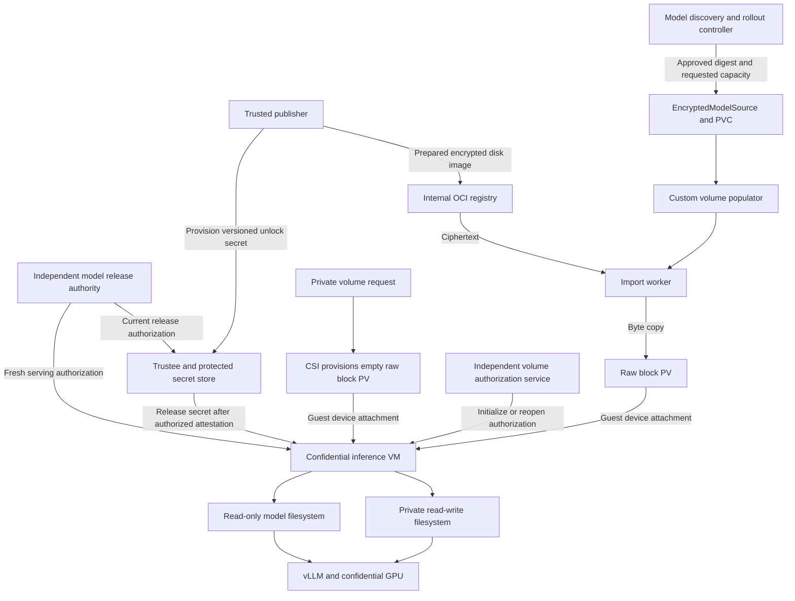
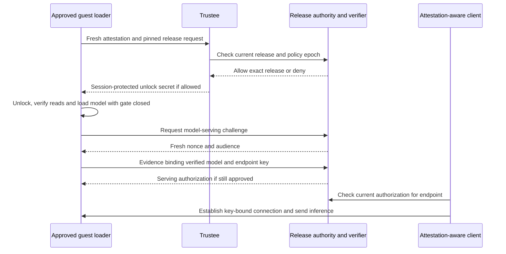

# Draft proposal for confidential model and private writable volumes

Updated: 10 October 2026

Use the internal OpenShift OCI registry to distribute immutable, populated LUKS2 disk images. A custom Kubernetes volume populator copies the encrypted images into raw-block PVCs. Confidential inference guests attest to Trustee, unlock and mount those volumes read-only, and start vLLM against a local model directory.

Extend attestation to the approved model release and the serving endpoint. An independently administered release authority maintains current authorization; a measured guest loader verifies model contents and binds its result to fresh evidence. For immutable models, add a dm-verity root anchored in the signed release descriptor to reject replayed blocks as they are read. Signatures and dm-integrity alone do not establish that a release is still authorized.

For model volumes, the inference guest performs no initial formatting, model download, or initial encryption. Registry, importer, storage backend, and host handle ciphertext. Only the trusted publisher and authorized confidential guests handle model plaintext and encryption keys.

Add a separate private persistent read-write volume for application state, generated data and checkpoints. CSI provisions an empty block PVC; approved guest infrastructure initializes it once and reopens it on later starts using Trustee-delivered credentials. Both profiles target ordinary directory mounts in an unprivileged application: `/models` read-only and `/data` read-write. Writable storage uses authenticated LUKS2/dm-integrity with protected headers, without dm-verity. The first version does not guarantee freshness of mutable disk contents or hostile-host writer fencing.

This is a proposed extension to the Qwen KServe proof of concept, not an installed or validated storage solution. The existing deployment retrieves an encrypted model artifact and decrypts into guest memory. Its current model artifact must be converted to the prepared-volume format described here. Private writable storage is also proposed work, not a validated capability of this deployment. Implementation must preserve the running KServe service until a separate storage test succeeds.

## Storage profiles

The profiles share device delivery, guest key retrieval, policy enforcement and mount lifecycle. Their initialization and integrity rules remain distinct.

| Responsibility | Immutable model volume | Private persistent writable volume |
| --- | --- | --- |
| Application path | `/models`, read-only | `/data`, read-write |
| Intended consumers | One or more read-only guests where supported | One confidential VM at a time; no cross-VM sharing |
| Provision storage | Existing CSI provisioner | Existing CSI provisioner |
| Prepare initial contents | Trusted publisher; custom populator copies encrypted OCI artifact | Guest service performs explicitly authorized first-use initialization |
| Protection | Preferred LUKS2 plus verity over header and ciphertext | LUKS2 authenticated dm-crypt/dm-integrity with journaled updates and authenticated header |
| Restart | Reopen approved immutable release | Reopen the same initialized volume; never format on open failure |
| Key identity | Versioned model release | Stable private volume identity with versioned credentials/header metadata |
| Freshness | Current model-release authorization plus pinned verity root | Mutable-sector and snapshot rollback not prevented in the initial version |

CSI and volume population are complementary. CSI provisions and attaches storage; the model populator fills a new PVC with ciphertext. An ordinary new writable volume needs no model source or populator. In both cases, only approved guest infrastructure decrypts and mounts the device.

## Architecture and responsibilities



| Component | Responsibility | Access to protected data or keys |
| --- | --- | --- |
| Trusted publisher | Build and sign the prepared encrypted volume | Yes, during publication |
| Model controller | Discover releases, request population, track consumers and coordinate rollout | No |
| Volume populator | Reconcile PVCs with the custom data source; manage population and handover | No |
| Import worker | Fetch, verify and copy encrypted bytes to the assigned device | No |
| CSI storage driver | Provision and attach the underlying volume | No |
| Model release authority and verifier | Maintain current allowed releases; verify model evidence and authorize serving | No model decryption key required |
| Volume authorization service | Authorize private-volume initialization, workload identity and credential/header versions | No plaintext data required; key provisioning is a separate trusted operation |
| Guest storage integration | Attest, initialize only when authorized, unlock, verify and mount within the VM | Yes |
| vLLM | Read model files from `/models` and perform inference | Plaintext model access |

Discovery and population may share one operator binary, but their permissions and reconciliation logic should remain separate. Neither controller should receive Trustee administration credentials or silently approve new release identities.

## Trust boundary and security guarantees

Treat the registry, storage backend, import worker, host, and ordinary Kubernetes control plane as untrusted for model confidentiality and authenticity. They can observe ciphertext, sizes, identifiers, timing and access patterns, and can deny service. Storage hardware attestation is not required for this model because storage is not entrusted with plaintext.

Trust the publisher, its signing authority, the attestation verifier, Trustee policy administration, the private-volume authorization service, and the approved guest software. Writable-volume authorization and recovery records require independent administration just as model-release authorization does. For this GPU inference workload, CPU and GPU evidence must satisfy its resource policy before secrets are released. Other private-volume workloads require their approved CPU/workload evidence and GPU evidence only where their policy calls for a GPU. The approved guest configuration must also constrain what code can access the secret. Hardware attestation alone is not authorization for arbitrary workload code.

The present PoC's permissive image/debug policy and co-located secret administration boundary need hardening before claiming protection against a malicious cluster administrator. A production design needs independently controlled Trustee secrets and policies, plus an approved guest policy bound to attestation. This proposal does not make those properties automatic.

The guest obtains an authenticated release descriptor using a trust anchor protected by its approved configuration. It pins the intended release identity and verifies model contents before use. A Kubernetes label, ConfigMap digest, LUKS UUID, or populator `Ready` condition alone does not establish authenticity when the control plane is outside the trust boundary.

### Why storage hardware attestation is not required

The design deliberately excludes the disk, storage controller, storage server and their firmware from the trusted computing base for model confidentiality and authenticity. Treat them as a black box that can return arbitrary bytes, preserve old snapshots, or stop responding. We do not need evidence that this hardware is running approved firmware to trust the model, because we do not trust it with model plaintext or rely on its claims about the data.

For model volumes, the trusted publisher encrypts the volume before it reaches the registry or storage backend. For writable volumes, the guest initializes encryption before any confidential application data is stored on the backing device. Importers, CSI components, storage caches and backups handle the encrypted representation. Decryption, verification and filesystem access occur inside an authorized confidential VM. The storage system has neither the unlock secret nor the unwrapped volume key. This applies equally to Path A and Path B: moving mount management into the platform must not move decryption onto the host.

| Action by malicious storage | Protection and remaining limit |
| --- | --- |
| Read or copy the volume | Guest-side encryption protects model contents; ciphertext and storage metadata remain observable |
| Modify encrypted sectors | Cryptographic authentication detects invalid modifications when read; the workload fails rather than accepting them |
| Return previously valid blocks | For models, the authorized dm-verity root constrains protected contents on each read. Writable volumes may accept old valid sector/tag pairs; no mutable-state freshness is claimed |
| Restore an entire old model image and its valid metadata | Independent current-release authorization rejects a revoked release; signatures alone are insufficient |
| Redirect attachment to another volume | The guest verifies the authorized descriptor, content identity and verified mapping; a device name or UUID alone is not trusted |
| Delete data, delay reads or disconnect | Availability is lost; encryption and attestation cannot force storage to serve data |

The cryptographic checks are anchored outside the untrusted volume: trusted publisher keys, measured guest configuration, and the independent release authority. A hash or public key supplied only by the same storage device would not establish trust. The guest must enforce verification and fail closed; simply attaching a LUKS-formatted PVC does not provide the full guarantee.

CPU and GPU attestation serve a different purpose. Those components host the environment that receives keys and processes plaintext, so their approved security state matters. Storage only needs to transport and retain ciphertext. Its firmware identity is therefore not a condition for key release in this proposal.

Storage hardware attestation could still be useful for a separate infrastructure assurance or compliance requirement. It would become relevant to this trust boundary if decryption, plaintext caching, or model computation were delegated to storage hardware. That is outside this design. We also do not claim to hide access patterns, prevent denial of service, or prove physical deletion of every retained copy. Normal TEE isolation and protection from unauthorized device access remain prerequisites; treating storage as untrusted does not remove those platform requirements.

## Prepared model OCI artifact

The preferred candidate for immutable models is a raw image containing a complete LUKS2 region followed by a dm-verity hash tree, with no partition table. The protected region includes the LUKS header and encrypted filesystem/model data. The descriptor selects a versioned profile and records the exact protected length and tree location. The alternative authenticated-sector profile described below uses a different layout; consumers must not infer the profile or silently substitute one for another.

```text
OCI manifest pinned by digest
  model.luks        encrypted LUKS region plus verity tree (preferred candidate)
  release.json      authenticated release descriptor
  signature         covers manifest and descriptor through verified digests
```

The descriptor records model identity/version, ciphertext blob digest and exact byte length, minimum device capacity, expected LUKS UUID, approved crypto/filesystem profile, key-resource version, file manifest with model hashes, required guest profile, and dm-verity root/geometry. The key reference is an identifier, not a secret. A UUID is useful for identifying mistakes but is not a security proof. The descriptor authenticates the ciphertext blob; the OCI manifest references both blob and descriptor. Avoid a circular digest by not placing the final enclosing OCI manifest digest inside that same descriptor.

OCI supports distributing content through manifests and blobs. Verify the internal OpenShift registry's acceptance of the chosen media types and signature storage mechanism. If arbitrary artifact/referrer support is insufficient, package the encrypted payload in a compatible OCI image layer and distribute a signed manifest through a supported mechanism. Do not assume current encrypted-bundle support proves all OCI artifact features. [OCI distribution specification](https://specs.opencontainers.org/distribution-spec/)

Pin every release by digest. Tags can help discover releases but must not determine what an already approved PVC contains. Encrypted data generally compresses poorly; avoid excessive unused filesystem capacity. Size the image for model contents, filesystem overhead and integrity metadata, and measure actual publication/import costs.

## Trusted model publication lifecycle

1. Authenticate the input model and select the exact weights, tokenizer and configuration. Produce a signed file manifest. Disable fetching unapproved remote model code during serving.
2. Generate a fresh volume encryption key through the approved LUKS tooling and a strong independent keyslot unlock secret. Use a new volume/key identity per release initially.
3. For the preferred immutable profile, create LUKS2 with the approved dm-crypt configuration and create the filesystem inside the opened mapping. Record the exact LUKS region size and reserve space after it for the verity tree.
4. Copy model files, verify their hashes, cleanly unmount the filesystem and close LUKS. Build dm-verity over the finalized LUKS region, including its header and ciphertext, and append the tree outside that region. Record its root and geometry in the authenticated descriptor. No header or payload writes are permitted after tree construction. The alternative profile requires its own publisher: verity protects the finalized plaintext filesystem inside LUKS, dm-crypt/dm-integrity protects sectors, and an independently authenticated header copy is required.
5. Reopen through the exact guest read-only stack: establish verity first, then open LUKS through the verified device. Test integrity enforcement and verify that startup requires no recovery writes. Close and hash the final image only after all writes finish.
6. Provision the versioned unlock secret into Trustee through an authorized publisher/admin workflow. Configure separate builder and inference access policies where appropriate; a builder does not inherently require a GPU.
7. Publish the image and authenticated descriptor. Mark the release eligible for consumption only after artifact availability, policy configuration and validation succeed.

Publication runs in a trusted producer environment or a dedicated confidential builder VM. An ordinary import Job must not decrypt the existing model bundle to construct the LUKS image. If conversion occurs in the cluster, its plaintext handling belongs inside the confidential builder.

## Encryption and integrity profile

The `dm` prefix means Linux device mapper. These components run in the guest kernel and expose layered block devices to the guest filesystem. LUKS is the on-disk encryption format and key-management structure, configured through cryptsetup; it is not a fourth data-processing layer above the filesystem.

| Component | Purpose in this proposal | Concrete example | What it does not establish |
| --- | --- | --- | --- |
| **dm-crypt** | Encrypts and decrypts sectors using the volume key inside the guest. With an authenticated mode, also computes and checks authentication tags. | A storage administrator copying the PVC obtains ciphertext rather than model weights. | Ordinary AES-XTS alone does not detect tampering. Encryption does not establish the approved model version. |
| **dm-integrity** | In the writable and alternative model profiles, stores per-sector metadata and coordinates data/tag writes; dm-crypt supplies and verifies the cryptographic tags. | A modified encrypted sector fails authentication instead of silently becoming corrupted plaintext. | Standalone CRC tags are not protection against a malicious writer. Valid old sector/tag pairs can still be replayed. |
| **dm-verity** | Verifies immutable blocks against an independently authenticated root. The preferred profile covers the LUKS header and ciphertext; the alternative covers the inner filesystem. | A header or data block from a different protected image fails against the approved root. | It provides no encryption and does not decide whether an entire correctly signed old release is still allowed. |
| **LUKS2 and cryptsetup** | Record encryption parameters and protected volume-key slots; configure the guest mappings after unlocking. | Rotate the Trustee-held unlock secret through keyslots without rewriting all model data. | Keyslot changes do not rotate the underlying volume key or revoke already unlocked guests. |
| **Trustee and release authorization** | Release secrets to approved attested guests and enforce the current permitted release identity/epoch through the proposed policy integration. | Deny a retired release even when its disk image and signature remain valid. | They cannot erase previously released keys or force untrusted storage to remain available. |

The kernel documents [dm-crypt encryption and authenticated modes](https://docs.kernel.org/admin-guide/device-mapper/dm-crypt.html), [dm-integrity metadata handling](https://docs.kernel.org/admin-guide/device-mapper/dm-integrity.html), and [dm-verity read verification](https://docs.kernel.org/admin-guide/device-mapper/verity.html) separately. In the writable and alternative model profiles, sector authentication is a combined dm-crypt/dm-integrity function, not a guarantee from the name `dm-integrity` alone. In the preferred immutable profile, dm-verity provides integrity against the authenticated root.

The preferred candidate for immutable model reads is:

```text
Untrusted PVC returns the LUKS image and verity tree
  → dm-verity verifies the complete LUKS region against the approved root
  → dm-crypt decrypts through a read-only LUKS mapping
  → the read-only filesystem exposes model bytes to vLLM
```

This ordering protects the LUKS header before cryptsetup consumes it and verifies subsequent reads. The verity root, protected length, tree offset and algorithms must come from authenticated release configuration, not untrusted disk metadata. Never open the original device directly after verifying a different mapping. Hash-tree metadata is outside encryption in this profile; it contains hashes of ciphertext, not plaintext model blocks.

For immutable volumes this stack can provide confidentiality and verified reads without dm-integrity. It remains a candidate to validate against the deployed runtime and the upstream prototype, not an installed feature. Changing any protected byte, including a LUKS keyslot, requires a new tree and descriptor.

The alternative authenticated-sector profile retains the earlier layout:

```text
Untrusted PVC returns ciphertext and tags
  → dm-integrity supplies sector metadata
  → dm-crypt authenticates and decrypts
  → inner dm-verity verifies plaintext filesystem blocks
  → read-only filesystem exposes model bytes
```

In that alternative, verity does not cover the outer LUKS header. Copy the complete expected header into guest-private memory, authenticate that exact copy against the approved descriptor or trusted authentication material, validate the permitted configuration, and use it as a detached header. Do not check host storage and then let cryptsetup reread it. Header changes require updated authentication material and release authorization. The [LUKS header security analysis](https://blog.trailofbits.com/2025/10/30/vulnerabilities-in-luks2-disk-encryption-for-confidential-vms/) explains why protecting payload sectors alone is insufficient.

All three device-mapper components are not universally necessary. Keep the alternative profile explicit and separately tested; measure its extra integrity metadata, compatibility and performance costs. For mutable storage, dm-verity cannot verify ordinary changing contents against a fixed root. The private writable profile below uses authenticated dm-crypt/dm-integrity with protected headers and explicit recovery and ownership rules. Mutable-state freshness remains a separate requirement, not a property of dm-integrity. CRC-only dm-integrity is insufficient against malicious modification.

Pin the guest kernel, cryptsetup version, algorithms, sector geometry and integrity options as a tested profile. Do not silently fall back to encryption without authentication if a required feature is absent. Avoid recovery modes that bypass verification or recalculate tags over untrusted data. The publisher must finish pending work so guests can open and read without modifying the shared image.

Integrity does not establish freshness. A valid older volume can still authenticate. Bind the expected release to protected guest configuration and independently controlled authorization. A current-release rule or trusted minimum version is needed when old signed releases must be rejected. Signature validity alone does not prevent rollback.

## Model attestation and replay protection

Model attestation here means evidence from approved guest software that it verified and loaded the authorized model package. A CPU quote does not automatically measure weights, and GPU attestation does not report a hash of the tensors used for an inference. Trust in this claim comes from the attested loader, constrained execution policy, verified storage path and approved serving code.

### Release identity and trusted freshness

Define release identity as the signed descriptor digest, exact ciphertext digest, model file-manifest digest and dm-verity root. Cover every serving input: weights, tokenizer, configuration, adapters and any permitted custom code. Forbid unlisted replacements, path escapes and runtime downloads. Pin the loader and vLLM image digests and serving configuration separately.

The release authority stores an exact allowlist per model and deployment audience, plus a monotonically advancing policy epoch and revocations. Version strings alone are insufficient. Keep this state outside the workload cluster's rollback domain, under independent credentials. Recovery from backups must not silently restore an older authorization epoch; define a durable external epoch checkpoint or equivalent recovery control.

A signed descriptor establishes publisher approval at publication time. At each launch, the verifier checks current authority state. The host cannot reauthorize an old release merely by restoring an old source object, PVC, signed descriptor, or policy ConfigMap. During an intentional rollout, the authority may allow two specific releases; a security rollback must be a new policy decision at a later epoch.

### Attested loader and two stage authorization

Bind the restrictive guest policy, approved loader identity and expected descriptor identity into measured configuration, using the deployed platform's validated Init-Data mechanism. The guest must actually enforce these values. Measuring an expected hash without checking the files does not attest the model. CoCo provides Init-Data binding and runtime-data binding primitives, but the model protocol below is a new integration, not an existing Trustee model-attestation feature. [CoCo Init-Data](https://confidentialcontainers.org/docs/features/initdata/), [Trustee attestation token bindings](https://github.com/confidential-containers/trustee/blob/main/attestation-service/docs/attestation_token.md)

There is an unavoidable order: plaintext weights cannot be measured until the disk is unlocked. Therefore use two distinct authorization stages:

1. **Authorize unlocking.** Verify fresh CPU/GPU evidence and the approved loader/policy configuration. Check the requested descriptor and key-resource identity against current release authorization. Trustee then releases only that release's unlock secret into the attested session. This authorizes a verifier/loader, not a claim that weights have already been checked.
2. **Authorize serving.** Inside the VM, unlock the volume, establish verified read-only storage, verify model files, and load vLLM behind a closed guest-side request gate. After loading succeeds, produce fresh evidence for the verified model state and endpoint key. A verifier checks that evidence against current release policy before the guest gate accepts inference.

KBS resource-policy checks and the serving verifier must use a consistent authorization epoch and fail closed if current policy cannot be obtained. RVPS reference values can help express expected measurements, but merely appending old and new hashes to an allowed list does not prevent rollback. The exact Trustee claims and policy interfaces must be validated against the installed version.

### Bind fresh evidence to the actual endpoint

The proposed serving statement contains the following logical fields; these are a protocol sketch, not native Trustee claim names:

```text
protocol domain and version
verifier challenge nonce and intended audience
signed descriptor digest and model file-manifest digest
dm-verity root and loader/serving configuration identity
load-complete state and authority policy epoch
guest-generated serving public-key digest
session binding to the relevant CPU/GPU evidence
```

Hash a canonical encoding with a domain separator and bind that digest into fresh attestation evidence using a supported attestation-agent flow. Preserve existing KBS nonce and public-key bindings; do not overwrite a report-data field reserved by its protocol. Use a separate model-evidence exchange or a validated protocol extension. The verifier must correlate CPU/GPU evidence with the actual guest and GPU used by vLLM, not accept an unrelated valid GPU report.

The verifier issues unpredictable single-use challenges and checks audience, outstanding session, evidence validity and current epoch. Bind its serving authorization to a private key generated and held in the same VM. Consumers must verify that authorization and connect to the endpoint proving possession of that key; otherwise a host could present good evidence and forward prompts to another server.

Only the constrained loader/supervisor may assert the measured serving state. Arbitrary application access to an evidence API would let malicious software submit the approved hash without reading the model. CoCo explicitly documents this evidence-factory risk. Do not enable a broad evidence endpoint as a shortcut. [CoCo attestation API security](https://confidentialcontainers.org/docs/features/get-attestation/)

### Protect reads after measurement

A one-time hash check followed by ordinary disk reads has a verification-to-use gap. Even dm-integrity can accept previously valid sector contents and tags. The preferred immutable serving stack is:

```text
vLLM
  read-only filesystem
  read-only dm-crypt / LUKS mapping
  dm-verity covering the complete LUKS region, including its header
  untrusted raw-block PVC
```

Dm-verity validates reads against a fixed authenticated root, so data or hash-tree blocks from a different protected image fail verification. Validate the complete geometry and configure failure behavior that never ignores corruption. The external release authority is still needed: an entire old volume and its old root can be internally consistent. [Linux dm-verity documentation](https://docs.kernel.org/admin-guide/device-mapper/verity.html)

The alternative profile places verity inside authenticated LUKS/dm-integrity and separately authenticates its detached header, as described above. These are distinct formats and activation sequences. Both require kernel, layout, read-only and corruption testing. Neither follows automatically from a LUKS label. Fully verifying and copying the model into guest-private memory before use is another approach, but retains the RAM scaling problem. Never claim equivalent protection from checking a hash once and subsequently rereading mutable storage.

### Continuous authorization and limits

For the first prototype, guarantee freshness at launch and at new attested client sessions. For revocation during service, add renewable serving authorization with explicit expiry and an independently enforced time source. Do not rely solely on a host-controlled guest clock. The trusted guest supervisor should stop accepting requests when renewal fails; external consumers must also reject expired or revoked authorization.

Strict freshness against rollback of an already running VM requires live remote authorization for each protected session or request, according to the threat model. An isolated guest restored with old keys and cached permission cannot prove its own freshness. Short leases bound the stale-serving window only when expiry is reliably enforced. Ordinary browser TLS and Kubernetes readiness do not perform these checks automatically; client verification or an attestation-aware identity service is additional work.

Revocation prevents new authorized use; it cannot erase plaintext or keys already disclosed to an authorized instance. Model attestation also is not a cryptographic proof of every GPU computation. Its guarantee depends on the approved loader and serving implementation using the verified inputs and maintaining the gate through reloads and errors.



The initial milestone rejects old volumes at new launch and fresh session authorization. Rejecting already running stale instances is a separate milestone requiring the live authorization mechanism above.

## Proposed model population API

The following is an API sketch, not an existing CRD or deployable manifest. Source specs should be immutable; use a new object for each release.

```yaml
apiVersion: models.example.com/v1alpha1
kind: EncryptedModelSource
metadata:
  name: qwen-v1
  namespace: gpu-workload
spec:
  artifactRef: registry.example/models/qwen@sha256:<manifest-digest>
  pullSecretRef:
    name: model-registry-reader
  verificationPolicyRef:
    name: approved-model-publisher
  format: luks2-ciphertext-verity-v1
---
apiVersion: v1
kind: PersistentVolumeClaim
metadata:
  name: qwen-v1-volume
  namespace: gpu-workload
spec:
  storageClassName: <validated-block-storage-class>
  volumeMode: Block
  accessModes:
    - ReadWriteOnce
  resources:
    requests:
      storage: 20Gi  # Illustrative; derive from the signed artifact size.
  dataSourceRef:
    apiGroup: models.example.com
    kind: EncryptedModelSource
    name: qwen-v1
```

Keep sources, consumer PVCs and registry credential references in the same namespace initially. If population workers use another namespace, implement deliberate credential handling with restricted scope rather than granting them broad Secret access. Registry credentials permit encrypted artifact retrieval only; they are not model unlock credentials.

The volume-populator mechanism is GA upstream since Kubernetes 1.33 and in OpenShift since 4.20. OpenShift 4.22 documents it as GA, enabled by default, and ships `volume-data-source-validator`; it does not ship the source-specific model populator. Our same-namespace `dataSourceRef` design requires no Technology Preview feature set. The EncryptedModelSource CRD, controller and OCI importer remain custom implementation work; platform GA does not imply Red Hat support for that custom code. This is documentation-based feature status, not a fresh check of the running cluster. [Kubernetes GA announcement](https://kubernetes.io/blog/2025/05/08/kubernetes-v1-33-volume-populators-ga/), [OpenShift 4.20 release notes](https://docs.redhat.com/en/documentation/openshift_container_platform/4.20/html-single/release_notes/index), [OpenShift 4.22 storage](https://docs.redhat.com/en/documentation/openshift_container_platform/4.22/html-single/storage/index)

Custom data sources require an installed controller. `dataSourceRef` does not execute code or teach a CSI driver how to import OCI content. Kubernetes' volume-populator framework provides the integration point. [Kubernetes volume populators](https://kubernetes.io/blog/2025/05/08/kubernetes-v1-33-volume-populators-ga/)

## Population timeline

The proposed controller uses a temporary claim, commonly called a prime PVC, to prepare the underlying PV before binding it to the consumer claim.

| Stage | Actor and action | Consumer state |
| --- | --- | --- |
| 1 Request | User, GitOps or model controller creates the source and consumer PVC | PVC Pending |
| 2 Reconcile | Populator observes the matching dataSourceRef and validates the request | PVC Pending |
| 3 Allocate | Populator creates a prime PVC; CSI provisions a block PV | Consumer PVC Pending; prime PVC Bound |
| 4 Populate | Worker pulls approved ciphertext, verifies signature/digests, writes and flushes the device | Inference cannot consume the incomplete volume |
| 5 Verify | Worker verifies the written image range and exits; controller releases worker attachment | Awaiting handover |
| 6 Handover | Populator machinery rebinds the same populated PV to the consumer claim | Consumer PVC Bound |
| 7 Cleanup | Controller removes temporary resources without deleting the handed-over PV | Available for attachment |
| 8 Consume | CSI and Kata attach the block device to the confidential guest | Guest can attest and unlock |

This follows the temporary-volume pattern used by the [volume-populator machinery](https://github.com/kubernetes-csi/lib-volume-populator). Use its supported lifecycle and finalizers rather than implementing ad hoc PV claim-reference edits.

The controller watches API events; KServe does not invoke it. With `WaitForFirstConsumer`, a consumer pod may need to exist to select a node/topology before provisioning proceeds. Support that flow rather than waiting unconditionally for a Bound PVC before creating any consumer. Prewarming without an inference pod requires a topology-aware preparation strategy validated with the storage driver.

The importer copies ciphertext bytes, not extracted model files. It never opens LUKS or formats the device. It must respect signed length limits, handle short writes, flush, and validate the copied range. Any extra device tail is outside the signed image and must not trigger automatic filesystem growth. A failed copy is never handed over as successful.

## Private persistent read-write storage

This profile serves one confidential VM at a time, with persistence across pod replacement. It does not use the model publisher, EncryptedModelSource or an OCI import job. Kubernetes/CSI supplies an empty raw-block PVC; the guest owns encryption and filesystem setup. No application container performs mount operations.

The [CAA peer-pod storage flow](https://confidentialcontainers.org/blog/2026/08/14/encrypted-persistent-storage-for-peer-pods-with-the-caa-csi-block-driver/#5-inside-the-tee-attestation--key-fetch--mount) is a useful integration reference: a guest interceptor calls CDH before the application starts. For bare-metal Kata, reuse that division of responsibility through the agent/CDH integration. Do not copy its LUKS-magic-based format decision: absence of a header does not authorize initialization.

### Volume identity and trusted authorization

Introduce an independently controlled volume authorization service, potentially sharing infrastructure with the model release authority. It maintains a durable record containing the logical volume ID, approved workload/guest policy, crypto/filesystem profile, credential reference and version, authenticated header identity/version, initialization state and operation generation. Kubernetes PVC UIDs and backend identifiers are useful attachment references, not cryptographic proof of identity.

Trustee retains or retrieves the versioned unlock secret and releases it to approved attested guests. The volume service authorizes initialize versus reopen, and the measured guest service enforces that authorization before mutation. Its state machine and integration with Trustee are new development; Trustee is not assumed to provide this lifecycle or a writer-lease API. Administrative and recovery state must remain outside the untrusted workload cluster's rollback domain.

Use a distinct strong credential and volume identity for each writable volume. A trusted provisioning process creates the unlock credential; guest cryptsetup creates the volume key during initial formatting. Protect and version the detached header that contains its encrypted keyslots. Header verification material must bind the volume ID and profile, using a defined MAC/signature scheme or an authenticated exact-header digest. Domain-separate any derived authentication key. Neither the CSI plugin nor application receives these secrets or administrative permissions.

### First use and reopen lifecycle

| State or operation | Required behavior |
| --- | --- |
| Provisioned, uninitialized | A raw-block PVC exists. No permission to format is inferred from its content or Kubernetes status |
| Begin initialization | Approved guest attests; the authority durably records `Initializing` and binds a single initialization attempt to the volume, generation and guest session before authorizing writes |
| Initialize | Guest validates the device/profile and allowed starting state, creates LUKS2 plus authenticated journaled integrity, initializes integrity metadata and ext4, and records authenticated recovery metadata |
| Commit initialization | Persist and flush the filesystem/header state, authenticate the finalized header, and acknowledge completion to the authority; it records `Ready` before normal application use |
| Reopen `Ready` | Fresh guest authorization and key retrieval; copy/authenticate the header in guest-private memory, open the protected device, recover the filesystem journal as permitted, then mount `/data` |
| Interrupted initialization | Reconcile the recorded operation and authenticated phases. Do not issue a fresh format request or infer success from disk magic; ambiguous state requires explicit recovery |
| Normal teardown | Stop consumers, flush, unmount, close mappings, then release the attachment |
| Retired | Deny new activation; retain or delete ciphertext and recovery material according to explicit retention policy |

These are proposed trusted-service states, not PVC phases. A zero-filled device check can detect unexpected content during an authorized first use, but cannot establish newness against a host that can substitute disks. A `Ready` volume presented as blank must be rejected. Destroy-and-recreate requires an explicit operation and a new generation/identity; it must not happen as an error-recovery shortcut.

Handle crashes between every disk write and authority-state transition. Bind retries to the same operation; record the header identity early enough to recover an interrupted attempt without accepting arbitrary host metadata. Start with conservative recovery that stops on ambiguous state. The [persistent LUKS prototype #1648](https://github.com/confidential-containers/guest-components/pull/1648) provides header and crash-state code to evaluate, but is not a complete implementation of the independent authorization protocol.

### Writable integrity and crash recovery

```text
Application writes /data
  → guest ext4 filesystem and its journal
  → dm-crypt encryption and cryptographic integrity tags
  → journaled dm-integrity data/tag storage
  → untrusted block PVC
```

Authenticate the copied LUKS header before cryptsetup uses it, and pass that guest-private copy as a detached header. Validate the complete allowed cipher, integrity, geometry and journal configuration. Do not trust parameters read directly from mutable host storage. dm-verity is not used for this changing filesystem.

Choose and pin a tested authenticated dm-crypt/dm-integrity profile, including protection of integrity/journal metadata. CRC-only integrity is insufficient. Require journaled data/tag updates and complete initial integrity setup before application use; do not copy ephemeral no-journal/no-wipe settings without a separate crash-consistency analysis. Filesystem journaling and integrity journaling solve different consistency problems. Both require correct flush/FUA ordering through guest, virtio, hypervisor and backend. Neither can force a malicious storage service to retain acknowledged writes. [Linux dm-integrity documentation](https://docs.kernel.org/admin-guide/device-mapper/dm-integrity.html)

On authentication failure, fail affected I/O and stop or isolate the application according to an explicit failure policy. Do not regenerate tags over untrusted data or enable a verification-bypass recovery mode during normal operation. Record that generic filesystems can expose partially completed application transactions after crashes; applications remain responsible for their own transactional semantics.

### Single consumer and freshness limits

Request `ReadWriteOncePod` where the CSI driver supports it, and validate raw-block attachment into the actual guest. `ReadWriteOnce` permits multiple pods on one node and is not an equivalent substitute. Use stop-before-start replacement, with confirmed teardown/detachment before a new normal consumer; if ownership is uncertain, stop automatic takeover and require recovery. [Kubernetes access modes](https://kubernetes.io/docs/concepts/storage/persistent-volumes/#access-modes)

This provides operational exclusivity under the supported Kubernetes/storage behavior, not fencing against a malicious host. An attacker may duplicate attachments or preserve a guest that already has the key. Limiting new key releases, tracking an owner or expiring an authority record alone cannot revoke that guest's block access. Hostile-host fencing would require an additional enforceable ownership protocol; do not claim it in the first version.

Authenticated sectors, headers and journals do not establish freshness. The host may replay old valid sector/tag pairs or an entire authenticated snapshot. An independent `Ready` record prevents automatic reinitialization, but does not track every application write and cannot prove the disk contains the newest state. Private and unshared does not mean rollback-resistant.

The initial writable profile explicitly excludes mutable-state rollback protection. Do not use it as the sole trusted source for security counters, authorization state or transaction history requiring freshness. Those uses need application-aware external commits/checkpoints or another reviewed rollback-resistant protocol. Ordinary snapshot restore must be an explicit recovery operation, never described as preserving latest-state guarantees.

### Unprivileged application interface

The guest agent/storage service prepares the mount before container startup and places it into the authorized container mount namespace. CDH performs authorized key retrieval and activation. Application containers receive neither the raw device nor device-mapper control, and cannot invoke the privileged storage API. A privileged init container or sidecar is not the proposed solution.

```text
One confidential pod VM
├── Guest services: Kata agent, storage service, CDH and attestation
│   Initialize/open, verify, mount, recover and close storage
└── Unprivileged application
    /models  read-only approved model
    /data    private read-write application state
```

The target is `privileged: false`, `allowPrivilegeEscalation: false` and no storage-related capabilities, ideally dropping all capabilities. Validate GPU access separately. Merely presenting a decrypted `volumeDevices` device does not meet this interface; guest-side filesystem mounting and container placement must also work.

CSI delivery still uses raw block storage. Define a policy-bound guest mount contract carrying volume identity, profile, initialize/reopen authorization and container destination; do not assume changing a PVC to `Filesystem` moves host mount operations into the guest. The exact declarative interface remains implementation work.

Writable contents must not silently replace model weights, tokenizer, adapters, code or serving configuration bound to the approved model release. If an application intentionally loads any of these from `/data`, it must reverify them and renew the corresponding serving authorization. Separate persistent application data from disposable caches, prompts and logs according to the workload's retention requirements.

### Backup, maintenance and scope

Snapshots contain ciphertext and the associated header/integrity metadata. Require application quiescing or a documented crash-consistent restore procedure; a disk snapshot alone does not guarantee application consistency or freshness. Keep versioned authenticated header/recovery material and required Trustee credentials under deliberate backup policy. Restoring a snapshot is an explicit rollback and may require reconciling external application state.

Defer online resize, live migration and in-place key rotation in the first version. Future header/keyslot maintenance needs a quiesced, authorized transaction that updates protected header metadata and coordinates recovery. Volume-key rotation can migrate data inside an approved guest to a newly initialized volume, but requires its own tested maintenance workflow. Revoking future key release cannot erase keys or plaintext already held by a guest.

## Guest and KServe integration

KServe references the populated PVC, not EncryptedModelSource. This fragment shows raw-device attachment only; it is not a complete InferenceService or a finished security configuration.

```yaml
spec:
  predictor:
    runtimeClassName: kata-cc-nvidia-gpu
    containers:
      - name: kserve-container
        image: <approved-vllm-image-by-digest>
        # Entrypoint runs guest bootstrap before starting vLLM.
        volumeDevices:
          - name: model
            devicePath: /dev/encrypted-model
    volumes:
      - name: model
        persistentVolumeClaim:
          claimName: qwen-v1-volume
          readOnly: true
```

Inside the guest, bootstrap validates the authenticated release descriptor and expected device profile, obtains the versioned secret through CDH after attestation and current release authorization, establishes dm-verity over the complete LUKS region for the preferred profile, and opens LUKS through that verified device before mounting the filesystem read-only at `/models`. The alternative profile must follow its separately specified header-authentication and inner-verity sequence. The bootstrap verifies approved model contents before starting `vllm serve /models` behind the guest request gate. Serving opens only after the model-evidence exchange succeeds. Failure at any step prevents inference. Kubernetes readiness reports this state but is not the security gate. Keys must not appear in argv, logs, Kubernetes Secrets or host files; any temporary secret file belongs on guest-private tmpfs and is removed after activation.

Initially, a controlled guest bootstrap can perform unlocking and mounting. Device-mapper access, kernel features, OpenShift security constraints and mount visibility must be proved on the actual guest. An init container's mounts are not automatically visible in another container; use the same-container bootstrap initially or a validated guest-agent mount workflow. Do not grant broad host privileges as a shortcut.

The long-term application interface is an already mounted `/models`, supplied by a CoCo-aware CSI/Kata agent/CDH integration. A custom populator does not provide that guest mount integration. Kata has direct-volume work, but its presence upstream does not prove compatibility with the installed OpenShift runtime or provide the Trustee/LUKS workflow automatically. [Kata direct-volume CSI project](https://github.com/kata-containers/kata-containers/tree/main/src/tools/csi-kata-directvolume)

Put persistent generated data and application state on the private writable `/data` volume. Put disposable caches and temporary inference data on separate guest-private ephemeral storage where appropriate. Account for guest page cache, integrity overhead, CPU decryption and GPU memory; disk-backed weights reduce the need to hold the whole decrypted artifact in tmpfs but do not eliminate model-loading memory requirements.

## Two implementation paths and development scope

Paths A and B describe who opens and mounts storage, independently of the read-only/read-write profiles. For model storage, both use the prepared OCI artifact, EncryptedModelSource, populator and release authorization. Writable storage instead uses ordinary CSI provisioning and the private-volume lifecycle above. A custom populator is a Kubernetes controller, not a CSI driver. Path B is the target for both profiles so application containers never need mount privileges.

| Decision | Path A existing block CSI and guest bootstrap | Path B transparent CoCo storage integration |
| --- | --- | --- |
| Storage provisioning | Existing CSI driver with validated raw-block support | Reuse the storage backend and its provisioning where possible |
| Workload interface | `volumeDevices` exposes encrypted storage; approved bootstrap prepares mounts | Declarative confidential-volume requests; application receives `/models` and/or `/data` |
| Unlock and mount owner | Guest bootstrap associated with the workload | Kata guest agent or dedicated trusted guest storage service, using CDH |
| Application change | Custom entrypoint or supervisor around vLLM | No storage setup in the vLLM entrypoint; model-serving attestation still needs integration |
| Custom CSI required | Not inherently; depends on actual device attachment compatibility | Possibly an extension or adapter, coordinated with runtime changes; not automatically a new storage driver |
| Main development risk | Guest device permissions, crypto support and mount lifecycle | Cross-component API, namespace handling, policy enforcement and supported platform packaging |
| Intended use | Fallback prototype and compatibility proof | Evaluate upstream prototype first; develop a reusable application-facing capability |

### Shared development for both paths

Develop a reproducible publisher for the authenticated encrypted disk format and signed descriptor; the EncryptedModelSource CRD and populator controller; a ciphertext-only importer; and lifecycle logic for release discovery, approval, population, retention and rollout. Reuse Kubernetes populator machinery and an existing CSI provisioner rather than implementing allocation and handover from scratch.

Develop the model-release authority integration, Trustee policies, trusted loader/verifier, endpoint-bound evidence exchange and serving authorization. Package restrictive guest policies and approved runtime/model identities. Moving mounts into the platform does not eliminate these security requirements or make ordinary vLLM automatically attest its loaded model.

Validate internal registry compatibility, image signatures, raw-block provisioning, prime-PVC handover, topology, clone/snapshot behavior and access modes. Build the corruption, replay, policy-denial and lifecycle tests described in the acceptance plan. These are common dependencies, not reasons to write a new CSI driver.

The writable profile additionally requires a volume authorization record/service, initialization and recovery protocol, authenticated header management, and tests for single-consumer replacement. Reuse the shared guest activation lifecycle, but never reuse model release state as a substitute for mutable-volume state.

### Path A existing CSI with guest bootstrap

```text
Populator → existing CSI raw-block PVC → Kata device attachment
         → guest bootstrap → CDH and Trustee → LUKS and verity → /models → vLLM
```

Develop and package an approved bootstrap/supervisor that resolves the correct guest device, validates the signed layout, obtains the key, establishes read-only device-mapper layers, mounts `/models`, and runs model verification and the serving gate. Implement cleanup for partial activation, failed startup, container restart and normal shutdown. Prevent duplicate mappings and ensure one consumer cannot close a mapping still in use.

Add the required guest tools and kernel capabilities to an approved image/profile where absent. Define the narrowest workable guest privileges, device permissions and OpenShift admission configuration. Start vLLM with reduced privileges after setup where supported. A same-container supervisor avoids assuming init-container mount propagation, but still needs verification of the actual namespace and runtime behavior.

Modify the test InferenceService template to use `volumeDevices`, run the bootstrap, pass authenticated release references, and distinguish storage setup, model verification and inference readiness. No host-side component receives the unlock secret, and no host-side filesystem staging is introduced.

The first go/no-go test is a tiny populated block PVC attached to the real confidential runtime. Prove that it can be opened, verified, mounted and read entirely inside the guest. If attachment or restricted guest setup is unsupported, identify the specific runtime/driver gap; do not describe Path A as working or silently compensate with host decryption.

Completion means the existing CSI driver remains usable without a custom replacement, the workload can restart and unlock the populated PVC, negative security tests pass, and vLLM serves through the approved guest gate. Use this as a fallback compatibility proof if the upstream guest-service prototype cannot yet deliver a mount on the target runtime. Evaluate the available Path B prototype before writing a new bootstrap or guest storage service.

### Path B transparent CoCo storage integration

In the normal Kubernetes Kata deployment model, one pod uses one VM, and its application containers share the guest kernel. The VM also has a guest system environment outside those containers. The Kata agent runs there as a system process and manages container creation and lifecycle; it is not a sidecar declared in the pod's `containers` list. [Kata architecture](https://github.com/kata-containers/kata-containers/blob/main/docs/design/architecture/README.md)

The intended Path B layout is:

```text
One confidential VM for one Kubernetes pod
├── Guest kernel
├── Guest system environment
│   ├── Kata agent and trusted storage service
│   │   Privileged device and mount operations, constrained by policy
│   └── CDH and attestation components
│       Authorized key retrieval inside the VM
└── Application container
    └── vLLM
        Read-only /models and private read-write /data
        No raw storage device or device-mapper access
        No storage-related CAP_SYS_ADMIN or privileged container setting
```

This path extends guest infrastructure rather than adding a privileged application sidecar. The host attaches the encrypted device; the guest agent validates the authorized volume request; guest storage code obtains the secret through CDH and opens the verified filesystem; then the agent mounts it into the application container's mount namespace before starting the application. The application can read an existing mount without permission to create or change mounts itself.

The storage-related target is `privileged: false`, no `CAP_SYS_ADMIN`, and no ability for the application to regain setup privileges. Validate GPU device access separately; these are requirements for the proposed storage integration, not a claim that a complete GPU workload manifest has passed testing. Restrict access to agent/storage control interfaces and raw devices so an application cannot bypass these limits indirectly.

Privileges still exist in the guest agent/storage service. That component is part of the attested trusted computing base and accepts only policy-authorized operations. The service and vLLM share a kernel; namespaces, capabilities and policy provide separation within the VM, not another hardware confidentiality boundary. Upstream provides parts of the LUKS/CDH/verity workflow, including persistent-volume prototypes; the complete mount interface and enforcement still require integration and validation on the target runtime.

A privileged sidecar would be a different design and would retain the concern about granting privileges to a pod container, along with mount-propagation complexity. Path A can also run vLLM without storage privileges after a correctly implemented bootstrap drops them. Path B's advantage is that application containers need not receive those privileges at any stage, and the platform consistently owns setup and cleanup; it is not automatically more secure than a correctly isolated Path A.

```text
Populator → populated encrypted volume → CSI and Kata coordination
         → guest agent and CDH unlock/verify/mount → application sees /models
```

Develop a versioned contract for the volume identity, authenticated descriptor or volume record, key-resource reference, access mode, initialize/reopen operation and container mount destination. Decide how a workload declares this request and how metadata crosses the CSI/runtime boundary. Host-supplied values are untrusted inputs: the guest must validate them against the authorized descriptor and policy. A generic CSI node plugin normally runs on the host, so secret retrieval and decryption cannot simply be moved into that plugin.

Implement or extend Kata shim/agent integration to identify the attached device, call the guest storage service/CDH, create the verified mapping, and bind the resulting filesystem into the correct container mount namespace before application startup. Add agent-policy authorization for each operation, with no host fallback and no permission to substitute an arbitrary key reference, device, root hash or mount destination.

Extend guest components to support the selected LUKS/integrity/verity profile and an idempotent mount lifecycle. Track active users of each mapping; handle startup cancellation, container and sandbox teardown, repeated requests, failed attestation and cleanup after component crashes. Release decrypted mappings and temporary credentials when the last authorized consumer exits.

Determine what the current CSI driver and runtime already support before choosing the CSI work. A supported direct-volume handoff may need only metadata/runtime adaptation. Otherwise, a CoCo-aware driver extension or adapter may be necessary to arrange raw-device delivery and lifecycle coordination. Any adapter must preserve backend provisioning, attachment, topology and recovery semantics; it cannot be assumed to transparently wrap every CSI driver. The upstream Kata direct-volume project is a candidate reference, not a completed implementation of this proposal.

Define the application-facing mount API explicitly. An ordinary filesystem PVC or changing `volumeMode: Block` to `Filesystem` does not cause an existing CSI driver to unlock inside the guest; it can instead trigger host formatting/mounting or fail on the LUKS device. Keep encrypted storage opaque on the host. A new mount declaration, admission translation or CSI/runtime-specific contract needs implementation and versioned documentation before promising a normal `volumeMount` experience.

Package the runtime, guest and any CSI changes for the target OpenShift/OSC versions; maintain upgrade and compatibility tests. Validate that an otherwise unmodified vLLM container receives only the approved read-only model and optional private read-write directory mounts, while the separate trusted model supervisor still controls load-complete evidence and serving authorization.

Completion means application storage setup disappears from the entrypoint, multiple workload types can use the integration, mount and teardown are reliable, and the same security tests pass without granting application containers mount privileges. This path has broader platform engineering and maintenance scope. Reuse Path A's publisher, populator and policy work when moving to it.

## Upstream implementation reuse

Status was checked on 8 October 2026. Merged upstream functionality, developer prototypes and installed OpenShift support are separate claims. Verify exact runtime and guest-component versions before selecting patches or changing workload manifests.

| Work | Status | Relevance |
| --- | --- | --- |
| [Confidential emptyDir, Kata #10559](https://github.com/kata-containers/kata-containers/pull/10559) | Merged | Guest-side encryption and mounting without application storage privileges |
| [Confidential container image storage](https://confidentialcontainers.org/docs/features/protected-storage/confidential-image-storage/) | Experimental upstream feature | Protected disk backing for container image and writable layers, reducing guest RAM consumption |
| [Persistent block storage RFC #13638](https://github.com/kata-containers/kata-containers/issues/13638) | Open proposal | Persistent-volume contract, measured authorization, trusted manifests and guest activation |
| [Confidential-volume prototype](https://github.com/confidential-containers/guest-components/pull/1648#issuecomment-5272774626) | Developer branches | Pre-populated immutable volumes using LUKS2 and dm-verity, with Kata integration |
| [CDH persistent LUKS #1648](https://github.com/confidential-containers/guest-components/pull/1648) | Open, unmerged | Authenticated headers, initialization recovery and safe reopening |
| [Persistent integrity #1663](https://github.com/confidential-containers/guest-components/pull/1663) | Closed, unmerged | Prototype journaled dm-integrity support and corruption tests |
| [Kata measured direct volumes #13637](https://github.com/kata-containers/kata-containers/pull/13637) | Closed, unmerged | Typed storage requests and runtime-rs/agent authorization |
| [CAA encrypted cloud volumes #3155](https://github.com/confidential-containers/cloud-api-adaptor/pull/3155) | Merged | CSI metadata and guest CDH integration for encrypted peer-pod storage |

### Existing guest storage mechanisms

Confidential emptyDir uses a host-backed block device encrypted and mounted inside the guest by Kata and CDH. Application containers receive the directory without needing storage-related CAP_SYS_ADMIN. Its native emptyDir implementation requires no separate CSI driver. This is an architectural precedent for Path B, but the storage is ephemeral and lacks rollback protection. Confidential image storage similarly provides ephemeral space for container layers; a backing PVC does not make it a persistent reusable model cache. [Confidential emptyDir documentation](https://confidentialcontainers.org/docs/features/protected-storage/confidential-emptydir/)

CDH already supports `sourceType: encrypted` and KBS key references to open an existing encrypted volume without formatting it. The inspected generic LUKS path does not implement the complete persistent model workflow: authenticated headers, enforced read-only activation and mounting, verity and release freshness remain integration requirements.

Reusable code includes the [Kata block-storage handler](https://github.com/kata-containers/kata-containers/blob/277e67e5da11a0264a5ca1c7e66a03932d8672cc/src/agent/src/storage/block_handler.rs), [CDH block-device handling](https://github.com/confidential-containers/guest-components/blob/fb113d59e459af5a22f5b15bbbf3e2c7f6344ebe/confidential-data-hub/hub/src/storage/volume_type/blockdevice/mod.rs), and [CDH LUKS driver](https://github.com/confidential-containers/guest-components/blob/fb113d59e459af5a22f5b15bbbf3e2c7f6344ebe/confidential-data-hub/hub/src/storage/drivers/luks2.rs). These links pin the inspected revisions.

### Persistent read-only prototype

The closest prototype uses the preferred ciphertext-verity layout described above. Its [CDH activation code](https://github.com/manuelh-dev/guest-components/blob/6acb6957adeabae8b4211c7378d4ade2daeba9f4/confidential-data-hub/hub/src/storage/secure_volume.rs) validates manifest geometry, creates verity, opens LUKS read-only, checks the mapper's read-only state and tracks mappings for cleanup. The expected root must come from the authenticated, currently authorized manifest.

The [corresponding Kata branch](https://github.com/manuelh-dev/kata-containers/tree/mahuber/confidential-ro-volume) includes runtime-rs, agent, genpolicy and test work. Its documented interface exposes an activated block device through `volumeDevices`; this is not proof that an unprivileged application already receives `/models`. Validate or implement guest filesystem mounting and container mount placement before startup. Its author also notes that the build integration needs updating. Inspect and test the branch against the installed runtime rather than assuming it can be applied unchanged.

The proposed activation/deactivation API is useful for separating CDH's key and mapping management from the agent's container placement. [CDH issue #1379](https://github.com/confidential-containers/guest-components/issues/1379) separately tracks the need for secure-storage state and close APIs. Do not assume the prototype lifecycle is available in released CDH.

### Header protection and alternative profiles

Upstream's [ephemeral-header fix #1313](https://github.com/confidential-containers/guest-components/pull/1313) puts newly created LUKS headers in guest memory; it explicitly leaves the existing-encrypted-volume path unchanged. The persistent LUKS prototype in #1648 authenticates a copied header before cryptsetup consumes it and tracks initialization state, avoiding reformatting on ordinary reopen failures. Header/state authentication alone provides neither data-sector integrity nor rollback protection.

Reuse these patterns for the alternative authenticated-sector profile and the private writable profile. For the preferred immutable profile, verity must cover the complete header and every LUKS region consumed, with cryptsetup reading only through the verified mapping. Any separately extracted header must remain authenticated for its exact use.

### Supporting work and remaining scope

Kata's [direct-volume interface](https://github.com/kata-containers/kata-containers/blob/main/docs/design/direct-blk-device-assignment.md) and [CSI reference driver](https://github.com/kata-containers/kata-containers/tree/main/src/tools/csi-kata-directvolume) provide block-delivery examples. The driver remains under development; neither component automatically provides the required confidentiality policy. CAA #3155 provides a peer-pod integration reference, not a drop-in solution for this bare-metal GPU runtime. Its format/reopen detection is not the immutable model policy: our consumer must never format a supplied model image.

Use measured agent policy and [Init-Data](https://confidentialcontainers.org/docs/features/initdata/) to authorize the manifest reference, requested access and destination. Host-provided metadata remains untrusted. The [merged CDH ZFS backend](https://github.com/confidential-containers/guest-components/pull/1344) is another storage option, but brings guest kernel/userspace dependencies and does not remove release freshness requirements; it is outside the initial LUKS model profile.

Evaluate the read-only CDH/Kata prototype before building a new guest storage service. Keep the OCI publisher, EncryptedModelSource and custom populator as the distribution layer, with ciphertext-only importers. Remaining work includes runtime compatibility, unprivileged filesystem delivery, authorization, teardown, current-release checks and end-to-end tests. A CSI adaptation is needed only where the selected driver/runtime cannot deliver the encrypted block device and necessary metadata safely.

## Model sharing and updates

Start with one consumer and one populated PVC. For replicas, use validated read-only multi-attachment or separate PVCs populated/cloned from the same approved encrypted image. CSI access modes and Kata device attachment determine feasibility. `ReadWriteOnce` may allow multiple pods on one node, but does not guarantee multi-guest attachment. Do not independently mount ordinary ext4/XFS read-write in multiple VMs. [Kubernetes access modes](https://kubernetes.io/docs/concepts/storage/persistent-volumes/#access-modes)

Each reader independently attests and receives an authorized unlock secret. Sharing an encrypted artifact means sharing its underlying volume key, including when separate keyslots are used. Use separate encryption domains if readers require cryptographic isolation from one another.

The release lifecycle is:

```text
Discovered → Approved → Populating → Populated → GuestValidated
           → Active → Retiring → Retired
```

These are proposed controller states, not native PVC phases. Record errors and retry status separately, with the observed source UID and immutable artifact digest. A populated PVC is an operational result, not proof of attestation or authentic model execution.

Registry polling or ImageStream observation creates a candidate release. Independent policy approves its publisher, digest and version before activation. Prepare a new PVC, run a confidential validation consumer, and switch the KServe claim reference only after it passes. Keep the old volume for an explicitly permitted rollback window. Rollback restrictions and operational recovery policy must agree.

Changing the predictor's PVC triggers a pod rollout. With the current single replica, expect a model reload and service interruption unless spare compatible GPU capacity permits a parallel rollout. Avoid pushing changes that cause existing GitOps definitions to restore the old standalone deployment or undo the colleague's KServe configuration.

## Key rotation and retirement

The following publication workflow applies to immutable model releases. Writable-volume maintenance has separate coordination requirements described above; do not replace live `/data` contents through the model populator.

Keyslot-secret rotation replaces the credential that unlocks the existing volume key. For immutable releases, perform header changes in the trusted publisher, never on a volume mounted by consumers. In the preferred profile, rebuild the ciphertext verity tree and publish a new image digest, root and authorized descriptor. In the alternative profile, update header authentication material and the descriptor even when the inner filesystem root is unchanged. Verify the new secret, roll out the new release and then retire the old slot/resource authorization. Existing mounted guests remain able to use the old volume, and saved old headers plus old secrets can still recover the unchanged key.

For actual volume-key rotation, create a newly encrypted artifact and new PVCs, then migrate consumers. This is the preferred approach for immutable models and avoids assuming in-place reencryption works with the selected integrity profile and multiple mounts. LUKS distinguishes keyslot changes from full volume reencryption. [Cryptsetup reencryption documentation](https://gitlab.com/cryptsetup/cryptsetup/-/blob/main/man/cryptsetup-reencrypt.8.adoc)

Retire releases only after consumers and importer attachments are gone. Apply deliberate retention policies to PVCs, PVs, snapshots, registry blobs and Trustee resources. Removing one keyslot or denying future key release cannot erase keys/plaintext already obtained by an authorized guest, nor ciphertext snapshots held elsewhere. Account for clones and backups before destroying a key required for recovery.

## Failure behavior and operations

| Failure | Required behavior |
| --- | --- |
| Unapproved publisher, digest mismatch or oversized payload | Reject before handover; leave consumer unbound and report the reason |
| Interrupted download or partial write | Retry safely or rebuild the prime volume; never claim completion from partial data |
| Controller restart during handover | Reconcile recorded ownership and PV binding idempotently; preserve the populated PV |
| Original PVC deleted during import | Stop worker and clean temporary resources according to policy |
| Storage attachment unsupported | Report compatibility failure; do not switch to host-side decryption |
| Trustee unavailable or attestation denied | No unlock and no inference readiness |
| Verity or sector authentication failure | Fail the read and serving gate; do not bypass verification or repair tags automatically |
| Header corruption or substituted crypto profile | Reject through the verified mapping or detached-header authentication before unsafe activation; never format the model device |
| Private volume initialization interrupted | Resume only the authorized operation through verified recovery states; ambiguous state stops startup |
| Initialized private volume appears blank | Reject; do not reformat or silently create a new volume |
| Private volume owner or detach state uncertain | Stop automatic replacement pending explicit recovery; do not claim hostile-host fencing |
| Valid old writable sectors or snapshot replayed | May be accepted in the initial profile; mutable-state freshness is not guaranteed |
| Old but correctly signed release presented | Enforce current trusted release policy; reject if revoked |
| Old quote, nonce or serving authorization replayed | Reject session/audience mismatch, reused challenge or stale authorization |
| Storage changes after the initial model check | Verify reads against the approved dm-verity root and fail on mismatch |
| Release authority unavailable | Deny fresh authorization; enforce the defined running-session expiry policy |
| Registry unavailable after successful population | Existing volume remains usable, subject to guest policy and Trustee availability |

Expose byte progress, artifact digest, population duration, PVC/PV identity, retry reason and guest validation outcome. Logs must exclude secrets, plaintext weights and prompts. Registry credentials should be read-only; importer access should be restricted to the assigned PVC and required namespace resources. The importer does not require a GPU or confidential execution because it handles ciphertext only.

Use reconciliation and finalizers to prevent deletion races. Before reclaiming a release, check active and desired workload references, temporary validation consumers and snapshot retention. Treat operator status as operational evidence; it does not replace guest-side verification against an untrusted host.

## Implementation and acceptance plan

1. **Evaluate upstream reuse and compatibility.** Compare the read-only CDH/Kata prototype, writable header/recovery work and CAA guest-mount pattern with the installed runtime, guest kernel, cryptsetup and CSI raw-block path. Record which changes are merged, which require porting, and whether the agent can deliver `/models` without application storage privileges. Use a separate workload; do not change the live predictor.
2. **Prove private writable storage in guest services first.** Use a disposable small PVC and unprivileged application. Implement explicit first-use authorization, protected headers, journaled integrity, guest mounting and cleanup. Prove write → sync → pod replacement → reopen → read, plus the writable negative tests below. Do not attach it to the live KServe workload.
3. **Prove the immutable profile with a tiny prepared volume.** Establish ciphertext verity, open LUKS read-only and mount inside the guest using CDH-delivered credentials. Test header/data corruption, wrong roots, attempted writes, reopen and cleanup. If Path B integration is unavailable, use controlled Path A bootstrap as a compatibility proof and record its privilege requirements.
4. **Build a reproducible publisher and importer.** Produce the finalized LUKS region and verity tree, sign the descriptor, publish through the internal registry and import ciphertext into a test PVC. Verify media-type and large-blob behavior. Never format the consumer device.
5. **Implement the custom populator.** Define EncryptedModelSource and its immutable fields, use supported populator machinery, and test Pending-to-Bound handover, topology, retries, cleanup and controller restarts.
6. **Complete guest mount delivery and integrate Qwen separately.** Reuse or extend agent/CDH activation and teardown; require only a verified directory in the vLLM container for Path B. Test inference in a separate KServe workload and compare cold-start time, storage, guest memory and throughput with the tmpfs flow.
7. **Implement model freshness and evidence.** Add independent release authorization, the measured loader, the second attestation exchange and endpoint-key binding. First test new-launch/session rollback rejection; then running-session revocation with enforceable online freshness. Successful inference alone does not complete this security milestone.
8. **Add controlled lifecycle management and packaging.** Introduce discovery, approval, rollout, retention and rotation. Test read-only sharing or per-replica clones. Package runtime/guest and any CSI adaptation for the target OpenShift versions, with upgrade tests, before production rollout.

Model-volume acceptance tests must include a successful inference; denied CPU/GPU/workload policy; wrong unlock secret; corrupted LUKS header; substituted verity root or geometry; ciphertext tampering after import; stale release rejection; partial import; dirty-image rejection; restart without importing again; safe model update; and keyslot versus volume-key rotation. For shared volumes, also test two simultaneous read-only guests and attempted writes. Use disposable volumes for corruption tests.

Model-attestation tests must restore a correctly signed but revoked old volume; substitute a different descriptor/key reference; replay old evidence and a consumed nonce; claim an approved hash from an unapproved loader; redirect a client to a different endpoint key; change an adapter or tokenizer; and replay previously valid blocks after initial verification. All must fail at the appropriate authorization or read boundary. Test authority state recovery without epoch rollback, deliberate two-version rollout, renewal refusal, and the stated limit for already running guests. Demonstrate that no inference request succeeds before the guest-side gate opens, even if host-controlled readiness or Service routing is manipulated.

Writable-volume acceptance tests must cover explicit initialization authorization; restart without reformatting; interrupted initialization at each disk/authority transition; wrong keys; modified headers; data/tag and journal corruption; guest crashes and filesystem recovery; second-pod attachment refusal under normal cluster operation; ambiguous ownership; cleanup after partial activation; and rejection of a blank device for a Ready record. Prove the application has no mount capabilities, raw-device access or privileged storage API access. Use disposable volumes for corruption and snapshot tests.

Demonstrate the stated writable limitations: a valid old snapshot may reopen, and scheduling/key-release controls alone do not fence a hostile host's retained guest. Tests must not report those behaviors as rollback resistance or secure exclusive ownership. Test restoration with external application state and ensure `/data` cannot bypass approved model identity.

The first implementation milestone is private writable guest-managed storage in an isolated unprivileged test workload. The model deliverable remains publisher → registry → populator → PVC → guest verification → vLLM. Both profiles must pass their own security and lifecycle tests before they are combined in a separate KServe test, and before any production rollout.
