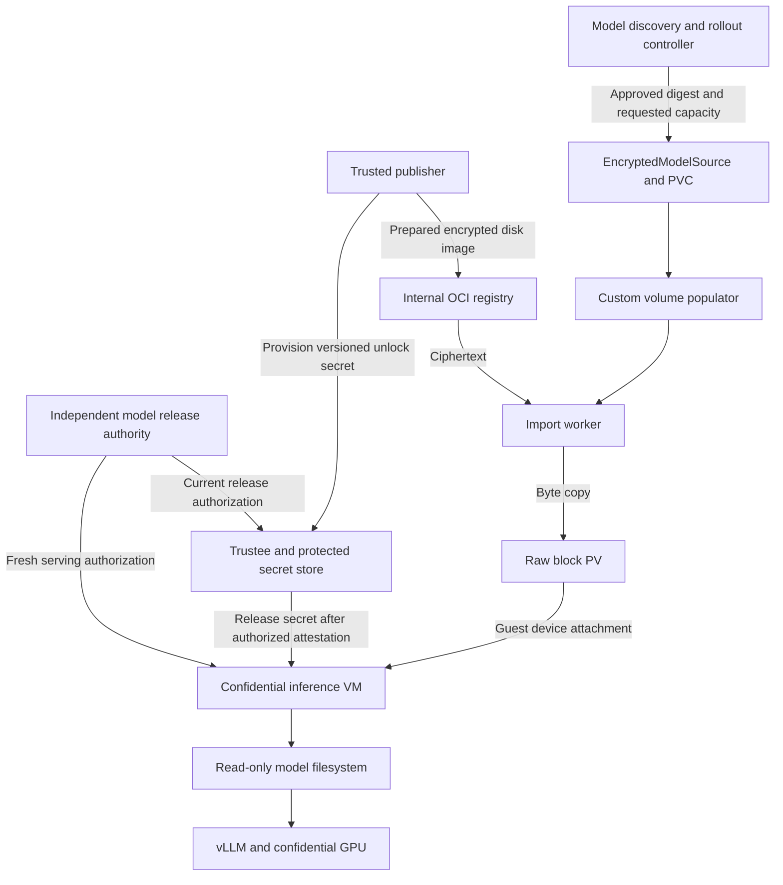
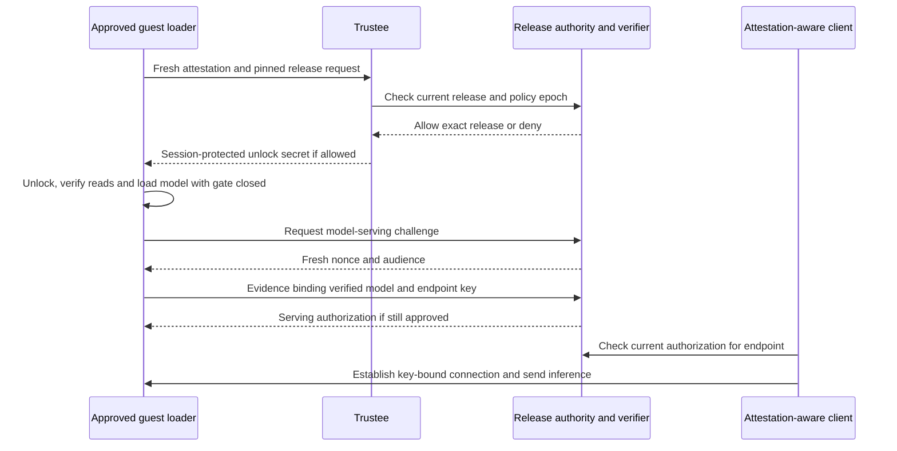

# Draft proposal for encrypted model volumes in confidential inference

Date: 8 October 2026

Use the internal OpenShift OCI registry to distribute immutable, populated LUKS2 disk images. A custom Kubernetes volume populator copies the encrypted images into raw-block PVCs. Confidential inference guests attest to Trustee, unlock and mount those volumes read-only, and start vLLM against a local model directory.

Extend attestation to the approved model release and the serving endpoint. An independently administered release authority maintains current authorization; a measured guest loader verifies model contents and binds its result to fresh evidence. For immutable models, add a dm-verity root anchored in the signed release descriptor to reject replayed blocks as they are read. Signatures and dm-integrity alone do not establish that a release is still authorized.

The inference guest performs no initial formatting, model download, or initial encryption. Registry, importer, storage backend, and host handle ciphertext. Only the trusted publisher and authorized confidential guests handle model plaintext and encryption keys.

This is a proposed extension to the Qwen KServe proof of concept, not an installed or validated storage solution. The existing deployment retrieves an encrypted model artifact and decrypts into guest memory. Its current artifact must be converted to the prepared-volume format described here. Implementation must preserve the running KServe service until a separate storage test succeeds.

## Architecture and responsibilities



| Component | Responsibility | Access to model secrets |
| --- | --- | --- |
| Trusted publisher | Build and sign the prepared encrypted volume | Yes, during publication |
| Model controller | Discover releases, request population, track consumers and coordinate rollout | No |
| Volume populator | Reconcile PVCs with the custom data source; manage population and handover | No |
| Import worker | Fetch, verify and copy encrypted bytes to the assigned device | No |
| CSI storage driver | Provision and attach the underlying volume | No |
| Model release authority and verifier | Maintain current allowed releases; verify model evidence and authorize serving | No model decryption key required |
| Guest storage integration | Attest, unlock, verify and mount within the VM | Yes |
| vLLM | Read model files from `/models` and perform inference | Plaintext model access |

Discovery and population may share one operator binary, but their permissions and reconciliation logic should remain separate. Neither controller should receive Trustee administration credentials or silently approve new release identities.

## Trust boundary and security guarantees

Treat the registry, storage backend, import worker, host, and ordinary Kubernetes control plane as untrusted for model confidentiality and authenticity. They can observe ciphertext, sizes, identifiers, timing and access patterns, and can deny service. Storage hardware attestation is not required for this model because storage is not entrusted with plaintext.

Trust the publisher, its signing authority, the attestation verifier, Trustee policy administration, and the approved guest software. A guest's CPU and GPU evidence must satisfy the inference policy before secrets are released. The approved guest configuration must also constrain what code can access the secret. Hardware attestation alone is not authorization for arbitrary workload code.

The present PoC's permissive image/debug policy and co-located secret administration boundary need hardening before claiming protection against a malicious cluster administrator. A production design needs independently controlled Trustee secrets and policies, plus an approved guest policy bound to attestation. This proposal does not make those properties automatic.

The guest obtains an authenticated release descriptor using a trust anchor protected by its approved configuration. It pins the intended release identity and verifies model contents before use. A Kubernetes label, ConfigMap digest, LUKS UUID, or populator `Ready` condition alone does not establish authenticity when the control plane is outside the trust boundary.

### Why storage hardware attestation is not required

The design deliberately excludes the disk, storage controller, storage server and their firmware from the trusted computing base for model confidentiality and authenticity. Treat them as a black box that can return arbitrary bytes, preserve old snapshots, or stop responding. We do not need evidence that this hardware is running approved firmware to trust the model, because we do not trust it with model plaintext or rely on its claims about the data.

The trusted publisher encrypts the volume before it reaches the registry or storage backend. Importers, CSI components, storage caches and backups handle the encrypted representation. Decryption, verification and filesystem access occur inside an authorized confidential VM. The storage system has neither the unlock secret nor the unwrapped volume key. This applies equally to Path A and Path B: moving mount management into the platform must not move decryption onto the host.

| Action by malicious storage | Protection and remaining limit |
| --- | --- |
| Read or copy the volume | Guest-side encryption protects model contents; ciphertext and storage metadata remain observable |
| Modify encrypted sectors | Cryptographic authentication detects invalid modifications when read; the workload fails rather than accepting them |
| Return previously valid blocks | The authorized dm-verity root constrains the exact filesystem contents accepted on each read |
| Restore an entire old model image and its valid metadata | Independent current-release authorization rejects a revoked release; signatures alone are insufficient |
| Redirect attachment to another volume | The guest verifies the authorized descriptor, content identity and verified mapping; a device name or UUID alone is not trusted |
| Delete data, delay reads or disconnect | Availability is lost; encryption and attestation cannot force storage to serve data |

The cryptographic checks are anchored outside the untrusted volume: trusted publisher keys, measured guest configuration, and the independent release authority. A hash or public key supplied only by the same storage device would not establish trust. The guest must enforce verification and fail closed; simply attaching a LUKS-formatted PVC does not provide the full guarantee.

CPU and GPU attestation serve a different purpose. Those components host the environment that receives keys and processes plaintext, so their approved security state matters. Storage only needs to transport and retain ciphertext. Its firmware identity is therefore not a condition for key release in this proposal.

Storage hardware attestation could still be useful for a separate infrastructure assurance or compliance requirement. It would become relevant to this trust boundary if decryption, plaintext caching, or model computation were delegated to storage hardware. That is outside this design. We also do not claim to hide access patterns, prevent denial of service, or prove physical deletion of every retained copy. Normal TEE isolation and protection from unauthorized device access remain prerequisites; treating storage as untrusted does not remove those platform requirements.

## Prepared OCI artifact

Publish a complete raw LUKS volume, with no partition table in the first implementation. This keeps the guest device mapping simple. The payload includes the LUKS header, integrity metadata, encrypted filesystem and model files.

```text
OCI manifest pinned by digest
  model.luks        complete encrypted block image
  release.json      authenticated release descriptor
  signature         covers manifest and descriptor through verified digests
```

The descriptor records model identity/version, ciphertext blob digest and exact byte length, minimum device capacity, expected LUKS UUID, approved crypto/filesystem profile, key-resource version, file manifest with model hashes, required guest profile, and dm-verity root/geometry. The key reference is an identifier, not a secret. A UUID is useful for identifying mistakes but is not a security proof. The descriptor authenticates the ciphertext blob; the OCI manifest references both blob and descriptor. Avoid a circular digest by not placing the final enclosing OCI manifest digest inside that same descriptor.

OCI supports distributing content through manifests and blobs. Verify the internal OpenShift registry's acceptance of the chosen media types and signature storage mechanism. If arbitrary artifact/referrer support is insufficient, package the encrypted payload in a compatible OCI image layer and distribute a signed manifest through a supported mechanism. Do not assume current encrypted-bundle support proves all OCI artifact features. [OCI distribution specification](https://specs.opencontainers.org/distribution-spec/)

Pin every release by digest. Tags can help discover releases but must not determine what an already approved PVC contains. Encrypted data generally compresses poorly; avoid excessive unused filesystem capacity. Size the image for model contents, filesystem overhead and integrity metadata, and measure actual publication/import costs.

## Trusted publication lifecycle

1. Authenticate the input model and select the exact weights, tokenizer and configuration. Produce a signed file manifest. Disable fetching unapproved remote model code during serving.
2. Generate a fresh volume encryption key through the approved LUKS tooling and a strong independent keyslot unlock secret. Use a new volume/key identity per release initially.
3. Create LUKS2 with a supported authenticated disk-encryption profile using dm-crypt and dm-integrity. Create the filesystem inside the opened mapping.
4. Copy model files, verify their hashes, and cleanly unmount the filesystem. Build a dm-verity tree for the finalized filesystem region within the decrypted volume, reserving a separate region for its hash tree. Record its root and geometry in the external signed descriptor. Finish integrity initialization and close LUKS cleanly; all written plaintext and hash-tree data pass through encryption.
5. Reopen with the exact guest read-only configuration; test integrity enforcement and verify that startup requires no recovery writes. Close and hash the final image only after all writes finish.
6. Provision the versioned unlock secret into Trustee through an authorized publisher/admin workflow. Configure separate builder and inference access policies where appropriate; a builder does not inherently require a GPU.
7. Publish the image and authenticated descriptor. Mark the release eligible for consumption only after artifact availability, policy configuration and validation succeed.

Publication runs in a trusted producer environment or a dedicated confidential builder VM. An ordinary import Job must not decrypt the existing model bundle to construct the LUKS image. If conversion occurs in the cluster, its plaintext handling belongs inside the confidential builder.

## Encryption and integrity profile

The `dm` prefix means Linux device mapper. These components run in the guest kernel and expose layered block devices to the guest filesystem. LUKS is the on-disk encryption format and key-management structure, configured through cryptsetup; it is not a fourth data-processing layer above the filesystem.

| Component | Purpose in this proposal | Concrete example | What it does not establish |
| --- | --- | --- | --- |
| **dm-crypt** | Encrypts and decrypts sectors using the volume key inside the guest. With an authenticated mode, also computes and checks authentication tags. | A storage administrator copying the PVC obtains ciphertext rather than model weights. | Ordinary AES-XTS alone does not detect tampering. Encryption does not establish the approved model version. |
| **dm-integrity** | Stores per-sector integrity metadata and coordinates data/tag writes. In our authenticated-encryption stack, dm-crypt supplies and verifies the cryptographic tags. | A modified encrypted sector fails authentication instead of silently becoming corrupted plaintext. | Standalone CRC tags are not protection against a malicious writer. Valid old sector/tag pairs can still be replayed. |
| **dm-verity** | Verifies read-only filesystem blocks through a hash tree anchored in an independently authenticated root hash. | A model block returned from a different image fails against the root pinned for this release. | It provides no encryption and does not decide whether an entire correctly signed old release is still allowed. |
| **LUKS2 and cryptsetup** | Record encryption parameters and protected volume-key slots; configure the guest mappings after unlocking. | Rotate the Trustee-held unlock secret through keyslots without rewriting all model data. | Keyslot changes do not rotate the underlying volume key or revoke already unlocked guests. |
| **Trustee and release authorization** | Release secrets to approved attested guests and enforce the current permitted release identity/epoch through the proposed policy integration. | Deny a retired release even when its disk image and signature remain valid. | They cannot erase previously released keys or force untrusted storage to remain available. |

The kernel documents [dm-crypt encryption and authenticated modes](https://docs.kernel.org/admin-guide/device-mapper/dm-crypt.html), [dm-integrity metadata handling](https://docs.kernel.org/admin-guide/device-mapper/dm-integrity.html), and [dm-verity read verification](https://docs.kernel.org/admin-guide/device-mapper/verity.html) separately. Authentication in the selected stack is a combined dm-crypt/dm-integrity function, not a guarantee from the name `dm-integrity` alone.

On a model read, the path is:

```text
Untrusted PVC returns ciphertext and tags
  → dm-integrity supplies the sector metadata
  → dm-crypt authenticates and decrypts
  → dm-verity checks the plaintext block against the approved root
  → the read-only filesystem exposes model bytes to vLLM
```

There is intentional overlap in corruption detection. For a strictly immutable image whose entire consumed filesystem is covered by a trusted verity root, dm-crypt plus dm-verity can provide confidentiality and verified reads without a separate authenticated-sector layer. All three are not universally necessary. This proposal retains dm-integrity for the authenticated-volume profile, including publication-time writes, and evaluates its additional storage, compatibility and performance cost. Any simplified profile must be a separately reviewed format; the runtime must never silently drop a required layer.

LUKS supplies keyslot management; ordinary AES-XTS disk encryption alone does not authenticate sectors. The required profile combines encryption with cryptographic authentication, using dm-integrity to support the integrity tags. CRC-only integrity is insufficient against malicious modification. The authenticated configuration should return an I/O error on modified data instead of allowing corrupted plaintext to reach the filesystem. [Linux dm-integrity documentation](https://docs.kernel.org/admin-guide/device-mapper/dm-integrity.html)

Pin the guest kernel, cryptsetup version, algorithms, sector geometry and integrity options as a tested profile. Do not silently fall back to encryption without authentication if a required feature is absent. Avoid recovery modes that bypass verification or recalculate tags over untrusted data. The publisher must finish pending work so guests can open and read without modifying the shared image.

Integrity does not establish freshness. A valid older volume can still authenticate. Bind the expected release to protected guest configuration and independently controlled authorization. A current-release rule or trusted minimum version is needed when old signed releases must be rejected. Signature validity alone does not prevent rollback.

## Model attestation and replay protection

Model attestation here means evidence from approved guest software that it verified and loaded the authorized model package. A CPU quote does not automatically measure weights, and GPU attestation does not report a hash of the tensors used for an inference. Trust in this claim comes from the attested loader, constrained execution policy, verified storage path and approved serving code.

### Release identity and trusted freshness

Define release identity as the signed descriptor digest, exact ciphertext digest, model file-manifest digest and dm-verity root. Cover every serving input: weights, tokenizer, configuration, adapters and any permitted custom code. Forbid unlisted replacements, path escapes and runtime downloads. Pin the loader and vLLM image digests and serving configuration separately.

The release authority stores an exact allowlist per model and deployment audience, plus a monotonically advancing policy epoch and revocations. Version strings alone are insufficient. Keep this state outside the workload cluster's rollback domain, under independent credentials. Recovery from backups must not silently restore an older authorization epoch; define a durable external epoch checkpoint or equivalent recovery control.

A signed descriptor establishes publisher approval at publication time. At each launch, the verifier checks current authority state. The host cannot reauthorize an old release merely by restoring an old source object, PVC, signed descriptor, or policy ConfigMap. During an intentional rollout, the authority may allow two specific releases; a security rollback must be a new policy decision at a later epoch.

### Attested loader and two stage authorization

Bind the restrictive guest policy, approved loader identity and expected descriptor identity into measured configuration, using the deployed platform's validated Init-Data mechanism. The guest must actually enforce these values. Measuring an expected hash without checking the files does not attest the model. CoCo provides Init-Data binding and runtime-data binding primitives, but the model protocol below is a new integration, not an existing Trustee model-attestation feature. [CoCo Init-Data](https://confidentialcontainers.org/docs/features/initdata/), [Trustee attestation token bindings](https://github.com/confidential-containers/trustee/blob/main/attestation-service/docs/attestation_token.md)

There is an unavoidable order: plaintext weights cannot be measured until the disk is unlocked. Therefore use two distinct authorization stages:

1. **Authorize unlocking.** Verify fresh CPU/GPU evidence and the approved loader/policy configuration. Check the requested descriptor and key-resource identity against current release authorization. Trustee then releases only that release's unlock secret into the attested session. This authorizes a verifier/loader, not a claim that weights have already been checked.
2. **Authorize serving.** Inside the VM, unlock the volume, establish verified read-only storage, verify model files, and load vLLM behind a closed guest-side request gate. After loading succeeds, produce fresh evidence for the verified model state and endpoint key. A verifier checks that evidence against current release policy before the guest gate accepts inference.

KBS resource-policy checks and the serving verifier must use a consistent authorization epoch and fail closed if current policy cannot be obtained. RVPS reference values can help express expected measurements, but merely appending old and new hashes to an allowed list does not prevent rollback. The exact Trustee claims and policy interfaces must be validated against the installed version.

### Bind fresh evidence to the actual endpoint

The proposed serving statement contains the following logical fields; these are a protocol sketch, not native Trustee claim names:

```text
protocol domain and version
verifier challenge nonce and intended audience
signed descriptor digest and model file-manifest digest
dm-verity root and loader/serving configuration identity
load-complete state and authority policy epoch
guest-generated serving public-key digest
session binding to the relevant CPU/GPU evidence
```

Hash a canonical encoding with a domain separator and bind that digest into fresh attestation evidence using a supported attestation-agent flow. Preserve existing KBS nonce and public-key bindings; do not overwrite a report-data field reserved by its protocol. Use a separate model-evidence exchange or a validated protocol extension. The verifier must correlate CPU/GPU evidence with the actual guest and GPU used by vLLM, not accept an unrelated valid GPU report.

The verifier issues unpredictable single-use challenges and checks audience, outstanding session, evidence validity and current epoch. Bind its serving authorization to a private key generated and held in the same VM. Consumers must verify that authorization and connect to the endpoint proving possession of that key; otherwise a host could present good evidence and forward prompts to another server.

Only the constrained loader/supervisor may assert the measured serving state. Arbitrary application access to an evidence API would let malicious software submit the approved hash without reading the model. CoCo explicitly documents this evidence-factory risk. Do not enable a broad evidence endpoint as a shortcut. [CoCo attestation API security](https://confidentialcontainers.org/docs/features/get-attestation/)

### Protect reads after measurement

A one-time hash check followed by ordinary disk reads has a verification-to-use gap. Even dm-integrity can accept previously valid sector contents and tags. The proposed immutable serving stack is:

```text
vLLM
  read-only filesystem
  dm-verity with root pinned by the authorized signed descriptor
  dm-crypt authenticated encryption with dm-integrity
  untrusted raw-block PVC
```

Dm-verity validates reads against a fixed authenticated root, so replayed data or hash-tree blocks from a different filesystem image fail verification. Validate the complete table geometry and configure failure behavior that never ignores corruption. The external release authority is still needed: an entire old volume and its old root can be internally consistent. [Linux dm-verity documentation](https://docs.kernel.org/admin-guide/device-mapper/verity.html)

This extra layer must be tested for kernel support, layout and cost. It complements authenticated disk encryption for the proposed design; it is not supplied automatically by LUKS. An alternative prototype may fully verify and copy the complete model to guest-private memory before loading, but that retains the RAM scaling problem this proposal aims to solve. Never claim equivalent replay protection from checking a hash once and subsequently rereading mutable storage.

### Continuous authorization and limits

For the first prototype, guarantee freshness at launch and at new attested client sessions. For revocation during service, add renewable serving authorization with explicit expiry and an independently enforced time source. Do not rely solely on a host-controlled guest clock. The trusted guest supervisor should stop accepting requests when renewal fails; external consumers must also reject expired or revoked authorization.

Strict freshness against rollback of an already running VM requires live remote authorization for each protected session or request, according to the threat model. An isolated guest restored with old keys and cached permission cannot prove its own freshness. Short leases bound the stale-serving window only when expiry is reliably enforced. Ordinary browser TLS and Kubernetes readiness do not perform these checks automatically; client verification or an attestation-aware identity service is additional work.

Revocation prevents new authorized use; it cannot erase plaintext or keys already disclosed to an authorized instance. Model attestation also is not a cryptographic proof of every GPU computation. Its guarantee depends on the approved loader and serving implementation using the verified inputs and maintaining the gate through reloads and errors.



The initial milestone rejects old volumes at new launch and fresh session authorization. Rejecting already running stale instances is a separate milestone requiring the live authorization mechanism above.

## Proposed Kubernetes API

The following is an API sketch, not an existing CRD or deployable manifest. Source specs should be immutable; use a new object for each release.

```yaml
apiVersion: models.example.com/v1alpha1
kind: EncryptedModelSource
metadata:
  name: qwen-v1
  namespace: gpu-workload
spec:
  artifactRef: registry.example/models/qwen@sha256:<manifest-digest>
  pullSecretRef:
    name: model-registry-reader
  verificationPolicyRef:
    name: approved-model-publisher
  format: luks2-integrity-v1
---
apiVersion: v1
kind: PersistentVolumeClaim
metadata:
  name: qwen-v1-volume
  namespace: gpu-workload
spec:
  storageClassName: <validated-block-storage-class>
  volumeMode: Block
  accessModes:
    - ReadWriteOnce
  resources:
    requests:
      storage: 20Gi  # Illustrative; derive from the signed artifact size.
  dataSourceRef:
    apiGroup: models.example.com
    kind: EncryptedModelSource
    name: qwen-v1
```

Keep sources, consumer PVCs and registry credential references in the same namespace initially. If population workers use another namespace, implement deliberate credential handling with restricted scope rather than granting them broad Secret access. Registry credentials permit encrypted artifact retrieval only; they are not model unlock credentials.

Custom data sources require an installed controller. `dataSourceRef` does not execute code or teach a CSI driver how to import OCI content. Kubernetes' volume-populator framework provides the integration point. [Kubernetes volume populators](https://kubernetes.io/blog/2025/05/08/kubernetes-v1-33-volume-populators-ga/)

## Population timeline

The proposed controller uses a temporary claim, commonly called a prime PVC, to prepare the underlying PV before binding it to the consumer claim.

| Stage | Actor and action | Consumer state |
| --- | --- | --- |
| 1 Request | User, GitOps or model controller creates the source and consumer PVC | PVC Pending |
| 2 Reconcile | Populator observes the matching dataSourceRef and validates the request | PVC Pending |
| 3 Allocate | Populator creates a prime PVC; CSI provisions a block PV | Consumer PVC Pending; prime PVC Bound |
| 4 Populate | Worker pulls approved ciphertext, verifies signature/digests, writes and flushes the device | Inference cannot consume the incomplete volume |
| 5 Verify | Worker verifies the written image range and exits; controller releases worker attachment | Awaiting handover |
| 6 Handover | Populator machinery rebinds the same populated PV to the consumer claim | Consumer PVC Bound |
| 7 Cleanup | Controller removes temporary resources without deleting the handed-over PV | Available for attachment |
| 8 Consume | CSI and Kata attach the block device to the confidential guest | Guest can attest and unlock |

This follows the temporary-volume pattern used by the [volume-populator machinery](https://github.com/kubernetes-csi/lib-volume-populator). Use its supported lifecycle and finalizers rather than implementing ad hoc PV claim-reference edits.

The controller watches API events; KServe does not invoke it. With `WaitForFirstConsumer`, a consumer pod may need to exist to select a node/topology before provisioning proceeds. Support that flow rather than waiting unconditionally for a Bound PVC before creating any consumer. Prewarming without an inference pod requires a topology-aware preparation strategy validated with the storage driver.

The importer copies ciphertext bytes, not extracted model files. It never opens LUKS or formats the device. It must respect signed length limits, handle short writes, flush, and validate the copied range. Any extra device tail is outside the signed image and must not trigger automatic filesystem growth. A failed copy is never handed over as successful.

## Guest and KServe integration

KServe references the populated PVC, not EncryptedModelSource. This fragment shows raw-device attachment only; it is not a complete InferenceService or a finished security configuration.

```yaml
spec:
  predictor:
    runtimeClassName: kata-cc-nvidia-gpu
    containers:
      - name: kserve-container
        image: <approved-vllm-image-by-digest>
        # Entrypoint runs guest bootstrap before starting vLLM.
        volumeDevices:
          - name: model
            devicePath: /dev/encrypted-model
    volumes:
      - name: model
        persistentVolumeClaim:
          claimName: qwen-v1-volume
          readOnly: true
```

Inside the guest, bootstrap validates the authenticated release descriptor and expected device profile, obtains the versioned secret through CDH after attestation and current release authorization, opens LUKS read-only, and establishes dm-verity before mounting the inner filesystem read-only at `/models`. It verifies approved model contents before starting `vllm serve /models` behind the guest request gate. Serving opens only after the model-evidence exchange succeeds. Failure at any step prevents inference. Kubernetes readiness reports this state but is not the security gate. Keys must not appear in argv, logs, Kubernetes Secrets or host files; any temporary secret file belongs on guest-private tmpfs and is removed after activation.

Initially, a controlled guest bootstrap can perform unlocking and mounting. Device-mapper access, kernel features, OpenShift security constraints and mount visibility must be proved on the actual guest. An init container's mounts are not automatically visible in another container; use the same-container bootstrap initially or a validated guest-agent mount workflow. Do not grant broad host privileges as a shortcut.

The long-term application interface is an already mounted `/models`, supplied by a CoCo-aware CSI/Kata agent/CDH integration. A custom populator does not provide that guest mount integration. Kata has direct-volume work, but its presence upstream does not prove compatibility with the installed OpenShift runtime or provide the Trustee/LUKS workflow automatically. [Kata direct-volume CSI project](https://github.com/kata-containers/kata-containers/tree/main/src/tools/csi-kata-directvolume)

Put caches, generated files and temporary inference data on separate guest-private storage. Account for guest page cache, integrity overhead, CPU decryption and GPU memory; disk-backed weights reduce the need to hold the whole decrypted artifact in tmpfs but do not eliminate model-loading memory requirements.

## Two implementation paths and development scope

Both paths use the same prepared OCI artifact, EncryptedModelSource, custom volume populator, release authorization and guest-side verification. They differ in who opens and mounts the encrypted device. A custom populator is a Kubernetes controller, not a CSI driver.

| Decision | Path A existing block CSI and guest bootstrap | Path B transparent CoCo storage integration |
| --- | --- | --- |
| Storage provisioning | Existing CSI driver with validated raw-block support | Reuse the storage backend and its provisioning where possible |
| Workload interface | `volumeDevices` exposes the encrypted device; approved bootstrap prepares `/models` | Declarative confidential-volume mount; application receives `/models` |
| Unlock and mount owner | Guest bootstrap associated with the workload | Kata guest agent or dedicated trusted guest storage service, using CDH |
| Application change | Custom entrypoint or supervisor around vLLM | No storage setup in the vLLM entrypoint; model-serving attestation still needs integration |
| Custom CSI required | Not inherently; depends on actual device attachment compatibility | Possibly an extension or adapter, coordinated with runtime changes; not automatically a new storage driver |
| Main development risk | Guest device permissions, crypto support and mount lifecycle | Cross-component API, namespace handling, policy enforcement and supported platform packaging |
| Intended use | First working prototype and compatibility proof | Reusable application-facing platform capability |

### Shared development for both paths

Develop a reproducible publisher for the authenticated encrypted disk format and signed descriptor; the EncryptedModelSource CRD and populator controller; a ciphertext-only importer; and lifecycle logic for release discovery, approval, population, retention and rollout. Reuse Kubernetes populator machinery and an existing CSI provisioner rather than implementing allocation and handover from scratch.

Develop the model-release authority integration, Trustee policies, trusted loader/verifier, endpoint-bound evidence exchange and serving authorization. Package restrictive guest policies and approved runtime/model identities. Moving mounts into the platform does not eliminate these security requirements or make ordinary vLLM automatically attest its loaded model.

Validate internal registry compatibility, image signatures, raw-block provisioning, prime-PVC handover, topology, clone/snapshot behavior and access modes. Build the corruption, replay, policy-denial and lifecycle tests described in the acceptance plan. These are common dependencies, not reasons to write a new CSI driver.

### Path A existing CSI with guest bootstrap

```text
Populator → existing CSI raw-block PVC → Kata device attachment
         → guest bootstrap → CDH and Trustee → LUKS and verity → /models → vLLM
```

Develop and package an approved bootstrap/supervisor that resolves the correct guest device, validates the signed layout, obtains the key, establishes read-only device-mapper layers, mounts `/models`, and runs model verification and the serving gate. Implement cleanup for partial activation, failed startup, container restart and normal shutdown. Prevent duplicate mappings and ensure one consumer cannot close a mapping still in use.

Add the required guest tools and kernel capabilities to an approved image/profile where absent. Define the narrowest workable guest privileges, device permissions and OpenShift admission configuration. Start vLLM with reduced privileges after setup where supported. A same-container supervisor avoids assuming init-container mount propagation, but still needs verification of the actual namespace and runtime behavior.

Modify the test InferenceService template to use `volumeDevices`, run the bootstrap, pass authenticated release references, and distinguish storage setup, model verification and inference readiness. No host-side component receives the unlock secret, and no host-side filesystem staging is introduced.

The first go/no-go test is a tiny populated block PVC attached to the real confidential runtime. Prove that it can be opened, verified, mounted and read entirely inside the guest. If attachment or restricted guest setup is unsupported, identify the specific runtime/driver gap; do not describe Path A as working or silently compensate with host decryption.

Completion means the existing CSI driver remains usable without a custom replacement, the workload can restart and unlock the populated PVC, negative security tests pass, and vLLM serves through the approved guest gate. This is the recommended first path.

### Path B transparent CoCo storage integration

```text
Populator → populated encrypted volume → CSI and Kata coordination
         → guest agent and CDH unlock/verify/mount → application sees /models
```

Develop a versioned contract for the volume identity, authenticated descriptor, key-resource reference, read-only requirement and container mount destination. Decide how a workload declares this request and how metadata crosses the CSI/runtime boundary. Host-supplied values are untrusted inputs: the guest must validate them against the authorized descriptor and policy. A generic CSI node plugin normally runs on the host, so secret retrieval and decryption cannot simply be moved into that plugin.

Implement or extend Kata shim/agent integration to identify the attached device, call the guest storage service/CDH, create the verified mapping, and bind the resulting filesystem into the correct container mount namespace before application startup. Add agent-policy authorization for each operation, with no host fallback and no permission to substitute an arbitrary key reference, device, root hash or mount destination.

Extend guest components to support the selected LUKS/integrity/verity profile and an idempotent mount lifecycle. Track active users of each mapping; handle startup cancellation, container and sandbox teardown, repeated requests, failed attestation and cleanup after component crashes. Release decrypted mappings and temporary credentials when the last authorized consumer exits.

Determine what the current CSI driver and runtime already support before choosing the CSI work. A supported direct-volume handoff may need only metadata/runtime adaptation. Otherwise, a CoCo-aware driver extension or adapter may be necessary to arrange raw-device delivery and lifecycle coordination. Any adapter must preserve backend provisioning, attachment, topology and recovery semantics; it cannot be assumed to transparently wrap every CSI driver. The upstream Kata direct-volume project is a candidate reference, not a completed implementation of this proposal.

Define the application-facing mount API explicitly. An ordinary filesystem PVC or changing `volumeMode: Block` to `Filesystem` does not cause an existing CSI driver to unlock inside the guest; it can instead trigger host formatting/mounting or fail on the LUKS device. Keep encrypted storage opaque on the host. A new mount declaration, admission translation or CSI/runtime-specific contract needs implementation and versioned documentation before promising a normal `volumeMount` experience.

Package the runtime, guest and any CSI changes for the target OpenShift/OSC versions; maintain upgrade and compatibility tests. Validate that an otherwise unmodified vLLM container receives only the verified read-only mount, while the separate trusted model supervisor still controls load-complete evidence and serving authorization.

Completion means application storage setup disappears from the entrypoint, multiple workload types can use the integration, mount and teardown are reliable, and the same security tests pass without granting application containers mount privileges. This path has broader platform engineering and maintenance scope. Reuse Path A's publisher, populator and policy work when moving to it.

## Sharing and updates

Start with one consumer and one populated PVC. For replicas, use validated read-only multi-attachment or separate PVCs populated/cloned from the same approved encrypted image. CSI access modes and Kata device attachment determine feasibility. `ReadWriteOnce` may allow multiple pods on one node, but does not guarantee multi-guest attachment. Do not independently mount ordinary ext4/XFS read-write in multiple VMs. [Kubernetes access modes](https://kubernetes.io/docs/concepts/storage/persistent-volumes/#access-modes)

Each reader independently attests and receives an authorized unlock secret. Sharing an encrypted artifact means sharing its underlying volume key, including when separate keyslots are used. Use separate encryption domains if readers require cryptographic isolation from one another.

The release lifecycle is:

```text
Discovered → Approved → Populating → Populated → GuestValidated
           → Active → Retiring → Retired
```

These are proposed controller states, not native PVC phases. Record errors and retry status separately, with the observed source UID and immutable artifact digest. A populated PVC is an operational result, not proof of attestation or authentic model execution.

Registry polling or ImageStream observation creates a candidate release. Independent policy approves its publisher, digest and version before activation. Prepare a new PVC, run a confidential validation consumer, and switch the KServe claim reference only after it passes. Keep the old volume for an explicitly permitted rollback window. Rollback restrictions and operational recovery policy must agree.

Changing the predictor's PVC triggers a pod rollout. With the current single replica, expect a model reload and service interruption unless spare compatible GPU capacity permits a parallel rollout. Avoid pushing changes that cause existing GitOps definitions to restore the old standalone deployment or undo the colleague's KServe configuration.

## Key rotation and retirement

Routine keyslot-secret rotation replaces the credential that unlocks the existing volume key. Coordinate header changes through one authorized writer, verify the new secret, update consumers and then retire the old slot/resource. Existing mounted guests remain able to use the volume. Saved old headers plus old secrets can still recover the unchanged key.

For actual volume-key rotation, create a newly encrypted artifact and new PVCs, then migrate consumers. This is the preferred approach for immutable models and avoids assuming in-place reencryption works with the selected integrity profile and multiple mounts. LUKS distinguishes keyslot changes from full volume reencryption. [Cryptsetup reencryption documentation](https://gitlab.com/cryptsetup/cryptsetup/-/blob/main/man/cryptsetup-reencrypt.8.adoc)

Retire releases only after consumers and importer attachments are gone. Apply deliberate retention policies to PVCs, PVs, snapshots, registry blobs and Trustee resources. Removing one keyslot or denying future key release cannot erase keys/plaintext already obtained by an authorized guest, nor ciphertext snapshots held elsewhere. Account for clones and backups before destroying a key required for recovery.

## Failure behavior and operations

| Failure | Required behavior |
| --- | --- |
| Unapproved publisher, digest mismatch or oversized payload | Reject before handover; leave consumer unbound and report the reason |
| Interrupted download or partial write | Retry safely or rebuild the prime volume; never claim completion from partial data |
| Controller restart during handover | Reconcile recorded ownership and PV binding idempotently; preserve the populated PV |
| Original PVC deleted during import | Stop worker and clean temporary resources according to policy |
| Storage attachment unsupported | Report compatibility failure; do not switch to host-side decryption |
| Trustee unavailable or attestation denied | No unlock and no inference readiness |
| Sector authentication failure | Fail the read and serving readiness; do not repair tags automatically |
| Old but correctly signed release presented | Enforce current trusted release policy; reject if revoked |
| Old quote, nonce or serving authorization replayed | Reject session/audience mismatch, reused challenge or stale authorization |
| Storage changes after the initial model check | Verify reads against the approved dm-verity root and fail on mismatch |
| Release authority unavailable | Deny fresh authorization; enforce the defined running-session expiry policy |
| Registry unavailable after successful population | Existing volume remains usable, subject to guest policy and Trustee availability |

Expose byte progress, artifact digest, population duration, PVC/PV identity, retry reason and guest validation outcome. Logs must exclude secrets, plaintext weights and prompts. Registry credentials should be read-only; importer access should be restricted to the assigned PVC and required namespace resources. The importer does not require a GPU or confidential execution because it handles ciphertext only.

Use reconciliation and finalizers to prevent deletion races. Before reclaiming a release, check active and desired workload references, temporary validation consumers and snapshot retention. Treat operator status as operational evidence; it does not replace guest-side verification against an untrusted host.

## Implementation and acceptance plan

1. **Prove Path A with a tiny test volume.** Check guest kernel/device-mapper/cryptsetup support, existing CSI raw-block attachment, read-only mounting with integrity enabled, and CDH-delivered unlock credentials. Record any driver/runtime gap that would require Path B work. Use a separate workload; do not change the live predictor.
2. **Build a reproducible publisher and importer.** Produce a small authenticated LUKS image and signed descriptor, upload it through the internal registry, and import ciphertext into a test PVC. Verify registry media-type and large-blob behavior.
3. **Implement the custom populator.** Define EncryptedModelSource and its immutable fields, use supported populator machinery, and test Pending-to-Bound handover, topology, retries, cleanup and controller restarts.
4. **Integrate Qwen in a separate KServe test.** Consume a prepared volume, enforce attestation and release identity, verify model files, and make an inference request. Measure cold-start time, storage use, guest memory and throughput against the existing tmpfs flow.
5. **Implement model freshness and evidence.** Add independently managed release authorization, the measured loader, verified reads, the second attestation exchange and endpoint-key binding. First test new-launch/session rollback rejection; then test revocation of running sessions with enforceable online freshness.
6. **Add controlled lifecycle management.** Introduce discovery, approval, release status, rollout, retention and rotation. Test read-only sharing or per-replica clones before increasing replicas.
7. **Develop Path B as a platform integration.** Define the confidential mount contract, implement guest-agent/CDH lifecycle and any necessary CSI/runtime adaptation, then replace application bootstrap only after the application-facing workflow passes compatibility and security tests.

Acceptance tests must include a successful inference; denied CPU/GPU/workload policy; wrong unlock secret; ciphertext tampering after import; stale release rejection; partial import; dirty-image rejection; restart without importing again; safe model update; and keyslot versus volume-key rotation. For shared volumes, also test two simultaneous read-only guests and attempted writes. Use disposable volumes for corruption tests.

Model-attestation tests must restore a correctly signed but revoked old volume; substitute a different descriptor/key reference; replay old evidence and a consumed nonce; claim an approved hash from an unapproved loader; redirect a client to a different endpoint key; change an adapter or tokenizer; and replay previously valid blocks after initial verification. All must fail at the appropriate authorization or read boundary. Test authority state recovery without epoch rollback, deliberate two-version rollout, renewal refusal, and the stated limit for already running guests. Demonstrate that no inference request succeeds before the guest-side gate opens, even if host-controlled readiness or Service routing is manipulated.

The first deliverable is a validated publisher → registry → populator → PVC → guest unlock → vLLM path. Automatic production rollout follows only after that path and the policy boundaries pass these tests.
